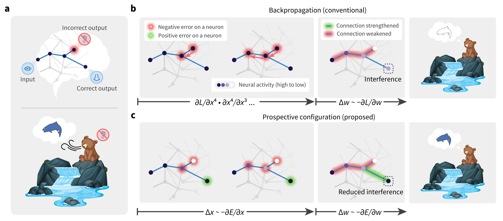

<!-- vscode-markdown-toc -->

-   1. [Setting up environment](#Settingupenvironment)
        - 1.1. [Set up environment variables](#Setupenvironmentvariables)
-   2. [Structure of the code](#Structureofthecode)
-   3. [Run the code to reproduce experiments and figures](#Runthecodetoreproduceexperimentsandfigures)
-   4. [Other notes](#Othernotes)
    -   4.1. [Warning and error messages](#Warninganderrormessages)
    -   4.2. [Reproducibility](#Reproducibility)
-   5. [Citation](#Citation)
-   6. [Contact](#Contact)

<!-- vscode-markdown-toc-config
	numbering=true
	autoSave=true
	/vscode-markdown-toc-config -->
<!-- /vscode-markdown-toc -->

# Inferring Neural Activity Before Plasticity: A Foundation for Learning Beyond Backpropagation

This repository contains the code for the paper [Inferring Neural Activity Before Plasticity as a Foundation for Learning Beyond Backpropagation](https://www.nature.com/articles/s41593-023-01514-1).
By _Yuhang Song\*_, _Beren Millidge_, _Tommaso Salvatori_, _Thomas Lukasiewicz_, _Zhenghua Xu_, _Rafal Bogacz\*_.
**doi**: https://doi.org/10.1038/s41593-023-01514-1. Published at _Nature Neuroscience_.



## 1. <a name='Settingupenvironment'></a>Setting up environment

This repo is configured with dev container, so open this project in VSCode and you will be prompted to open it in a dev container, which is with everything setup and the code is ready to run.

## 2. <a name='Structureofthecode'></a>Structure of the code

The code is organized as follows:

-   files in `./` are the main files for running the code. Following gives a brief description of each file.
    -   `main.py`: Calling this file with configuration yaml file will will launch experiments (the backbone of the code is ray, which will launch multiple processes to run the code in parallel)
    -   `utils.py`: Utility functions
    -   `analysis_v1.py`: Functions for analyzing the results. Calling this file with configuration file will load the results and plot the figures.
    -   `analysis_utils.py`: Utility functions for analysis.
    -   `*_trainable.py`: Various trainable classes that is shared across different experiments.
    -   `data_utils.py`: Utility functions for dataset.
    -   `fit_data.py`: Functions for fitting data from biological experiments.
-   `experiments`: This folder contains all the experiments. Specifically, each subfolder contains
    -   the `README.md` file that describes the experiment, document the comments to run to reproduce the experiment and reproduce the figure in the paper.
    -   the configuration file(s) (`.yaml`) for the experiment.
    -   `.py` files that are specific to the experiment.
    -   `.png` and `.pdf` files that are the figures generated by the experiment.

## 3. <a name='Runthecodetoreproduceexperimentsandfigures'></a>Run the code to reproduce experiments and figures

The simply look into each subfolders in `experiments` and follow the instructions in the `README.md` file, where the resulted figures are also documented.

By reading each `README.md` file in a markdown editor (such as viewing it on github), the resulted figures are attached inline, so it is obvious which corresponding figure it produces in the paper.

Before looking at each experiment folder, we explain the shared underlying logic of the code.
In each experiment folder, the `README.md` documents two kinds of commands to run:

-   `python main.py -c <config_file.yaml>`: This command will launch the experiment. The experiment will be launched in parallel with multiple processes (with ray as backend), and the results will be saved to `$RESULTS_DIR` in your environment variable.
    -   You will see command `ray job submit --runtime-env runtime_envs/runtime_env_without_ip.yaml --address $pssr -- ` before `python main.py -c <config_file.yaml>`, it is to submit the job to ray cluster to run instead of run locally.
        -   If you want to run locally, you can simply remove this command, and run `python main.py -c <config_file.yaml>` on your local machine.
        -   If you want to run on a ray cluster, you will need to get yourself educated about [ray cluster](https://docs.ray.io/en/latest/cluster/getting-started.html). Then you need to set up a ray cluster and set the environment variable `$pssr` to the address of the ray cluster.
-   `python analysis_v1.py -c <config_file.yaml>`: This command will load the results from `$RESULTS_DIR` and plot the figures. The figures will be saved to the experiment folder.
    -   This command does not limit to produce figures though, it loads the results as a pandas dataframe and do anything with it, depending on the exec commands you passed to it. For example, it is sometimes used to produced tables as well.

## 5. <a name='Citation'></a>Citation

We kindly ask you to cite our paper if you use our code in your research.

```bib
@article {Song2022.05.17.492325,
    author = {Song, Yuhang and Millidge, Beren and Salvatori, Tommaso and Lukasiewicz, Thomas and Xu, Zhenghua and Bogacz, Rafal},
    title = {Inferring Neural Activity Before Plasticity: A Foundation for Learning Beyond Backpropagation},
    elocation-id = {2022.05.17.492325},
    year = {2022},
    doi = {10.1101/2022.05.17.492325},
    publisher = {Cold Spring Harbor Laboratory},
    abstract = {For both humans and machines, the essence of learning is to pinpoint which components in its information processing pipeline are responsible for an error in its output {\textemdash} a challenge that is known as credit assignment1. How the brain solves credit assignment is a key question in neuroscience, and also of significant importance for artificial intelligence. Many recent studies1{\textendash}12 presuppose that it is solved by backpropagation13{\textendash}16, which is also the foundation of modern machine learning17{\textendash}22. However, it has been questioned whether it is possible for the brain to implement backpropagation23, 24, and learning in the brain may actually be more efficient and effective than backpropagation25. Here, we set out a fundamentally different principle on credit assignment, called prospective configuration. In prospective configuration, the network first infers the pattern of neural activity that should result from learning, and then the synaptic weights are modified to consolidate the change in neural activity. We demonstrate that this distinct mechanism, in contrast to backpropagation, (1) underlies learning in a well-established family of models of cortical circuits, (2) enables learning that is more efficient and effective in many contexts faced by biological organisms, and (3) reproduces surprising patterns of neural activity and behaviour observed in diverse human and animal learning experiments. Our findings establish a new foundation for learning beyond backpropagation, for both understanding biological learning and building artificial intelligence.Competing Interest StatementThe authors have declared no competing interest.},
    URL = {https://www.biorxiv.org/content/early/2022/05/18/2022.05.17.492325},
    eprint = {https://www.biorxiv.org/content/early/2022/05/18/2022.05.17.492325.full.pdf},
    journal = {bioRxiv}
}
```

## 6. <a name='Contact'></a>Contact

For questionts about the code, please open an issue in this repository.

For questions about the paper, please [contact Yuhang Song and Rafal Bogacz](mailto:yuhang.song@bndu.ox.ac.uk;rafal.bogacz@ndcn.ox.ac.uk).
