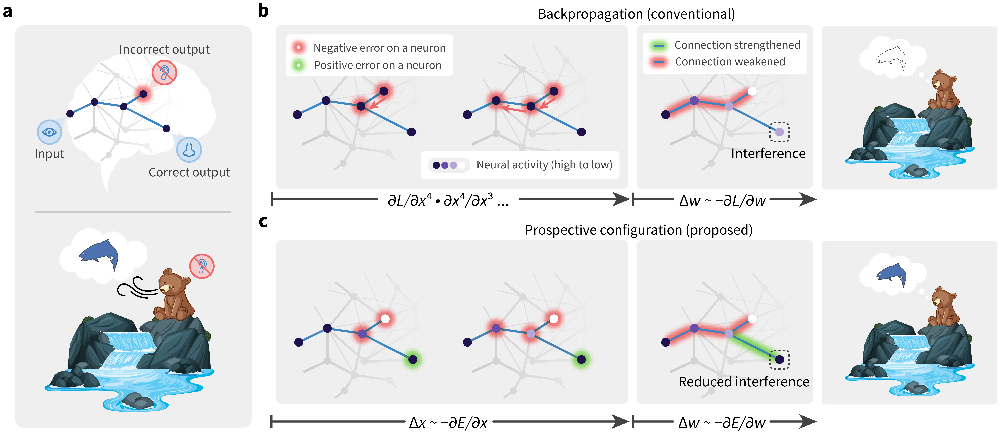

# Inferring Neural Activity Before Plasticity: A Foundation for Learning Beyond Backpropagation



## Setting up environment

A `Dockerfile` and a pre-built docker image from this `Dockerfile` is available on docker hub [here](yuhangsongchina/general-energy-nets:1.0).

For those who are not familiar with docker, it provides a image of a light-weighted virtual machine, which is widedly used as a frozen version of a environment ready for running the code with all dependencies installed.
Our code is run and tested on major Linux distributions and Darwin/Mac systems, but not on Windows, in case users are on platforms that we haven't tested our code, such as Windows, and having difficulty setting up environment, one can use the docker image which will start a virtual machine with frozen environment ready to run our code.

For those who don't want to use docker, they can refer to comments in `Dockerfile` to set up the environment.
As can be seen in the `Dockerfile`, all packages are pretty standard and can be installed with `pip` or `conda`.

If you are not familar with docker but want to learn and use docker, [get started with docker](https://docs.docker.com/get-started/).

If you prefer to use conda, [get started with conda](https://conda.io/projects/conda/en/latest/user-guide/getting-started.html#managing-python).

We recommend using docker.

## Structure of the code

The code is organized as follows:

- files in `./` are the main files for running the code. Following gives a brief description of each file.
  - `main.py`: Calling this file with configuration yaml file will will launch experiments (the backbone of the code is ray, which will launch multiple processes to run the code in parallel)
  - `utils.py`: Utility functions
  - `analysis_v1.py`: Functions for analyzing the results. Calling this file with configuration file will load the results and plot the figures.
  - `analysis_utils.py`: Utility functions for analysis.
  - `*_trainable.py`: Various trainable classes that is shared across different experiments.
  - `data_utils.py`: Utility functions for dataset.
  - `fit_data.py`: Functions for fitting data from biological experiments.
- `experiments`: This folder contains all the experiments. Specifically, each subfolder contains
  - the `README.md` file that describes the experiment, document the comments to run to reproduce the experiment and reproduce the figure in the paper.
  - the configuration file(s) (`.yaml`) for the experiment.
  - `.py` files that are specific to the experiment.
  - `.png` and `.pdf` files that are the figures generated by the experiment.
- `tests`: This folder contains unit test for all layers of the code. They are coded in pytest style.

## Run the code to reproduce experiments and figures

The simply look into each subfolders in `experiments` and follow the instructions in the `README.md` file, where the resulted figures are also documented.

By reading each `README.md` file in a markdown editor (such as viewing it on github), the resulted figures are attached inline, so it is obvious which corresponding figure it produces in the paper.

## Citation

We kindly ask you to cite our paper if you use our code in your research.

```bib
@article {Song2022.05.17.492325,
	author = {Song, Yuhang and Millidge, Beren and Salvatori, Tommaso and Lukasiewicz, Thomas and Xu, Zhenghua and Bogacz, Rafal},
	title = {Inferring Neural Activity Before Plasticity: A Foundation for Learning Beyond Backpropagation},
	elocation-id = {2022.05.17.492325},
	year = {2022},
	doi = {10.1101/2022.05.17.492325},
	publisher = {Cold Spring Harbor Laboratory},
	abstract = {For both humans and machines, the essence of learning is to pinpoint which components in its information processing pipeline are responsible for an error in its output {\textemdash} a challenge that is known as credit assignment1. How the brain solves credit assignment is a key question in neuroscience, and also of significant importance for artificial intelligence. Many recent studies1{\textendash}12 presuppose that it is solved by backpropagation13{\textendash}16, which is also the foundation of modern machine learning17{\textendash}22. However, it has been questioned whether it is possible for the brain to implement backpropagation23, 24, and learning in the brain may actually be more efficient and effective than backpropagation25. Here, we set out a fundamentally different principle on credit assignment, called prospective configuration. In prospective configuration, the network first infers the pattern of neural activity that should result from learning, and then the synaptic weights are modified to consolidate the change in neural activity. We demonstrate that this distinct mechanism, in contrast to backpropagation, (1) underlies learning in a well-established family of models of cortical circuits, (2) enables learning that is more efficient and effective in many contexts faced by biological organisms, and (3) reproduces surprising patterns of neural activity and behaviour observed in diverse human and animal learning experiments. Our findings establish a new foundation for learning beyond backpropagation, for both understanding biological learning and building artificial intelligence.Competing Interest StatementThe authors have declared no competing interest.},
	URL = {https://www.biorxiv.org/content/early/2022/05/18/2022.05.17.492325},
	eprint = {https://www.biorxiv.org/content/early/2022/05/18/2022.05.17.492325.full.pdf},
	journal = {bioRxiv}
}
```
