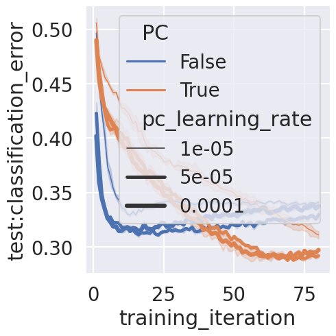
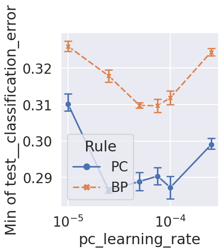

- [base](#base)
  - [min](#min)

# base

Evaluate RBP and PPC for response of nature neuroscience.

```bash
ray job submit --runtime-env runtime_envs/runtime_env_without_ip.yaml --address $PSSR -- python main.py -c nature_cnn_v2/base-rbp
ray job submit --runtime-env runtime_envs/runtime_env_without_ip.yaml --address $PSSR -- python main.py -c nature_cnn_v2/base-ppc
```

<!-- ## curve

```bash
python analysis_v1.py \
-t "base-curve" \
-l "$RESULTS_DIR/nature_cnn_v2/" \
-m "compress_plot('test__classification_error','training_iteration')" \
-f "./experiments/nature_cnn_v2/base-rbp.yaml" "./experiments/nature_cnn_v2/base-ppc.yaml" \
-v \
"import analysis_utils as au" \
"df=au.extract_plot(df,'test__classification_error','training_iteration')" \
"g=au.nature_relplot_curve(data=df,y='test__classification_error',x='training_iteration',size='pc_learning_rate',size_norm=matplotlib.colors.LogNorm(),hue='PC',legend_out=False)"
```

 -->

## min

```bash
python analysis_v1.py \
-t "base-min" \
-l "$RESULTS_DIR/nature_cnn_v2/" \
-m "df['test__classification_error'].min()" \
-f "./experiments/nature_cnn_v2/base-rbp.yaml" "./experiments/nature_cnn_v2/base-ppc.yaml" \
-v \
"import analysis_utils as au" \
"df=au.nature_pre(df)" \
"g=au.nature_relplot(data=df,y='Min of test__classification_error',x='pc_learning_rate',hue='Rule',style='Rule').set(xscale='log')"
```

