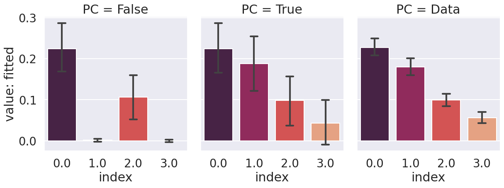
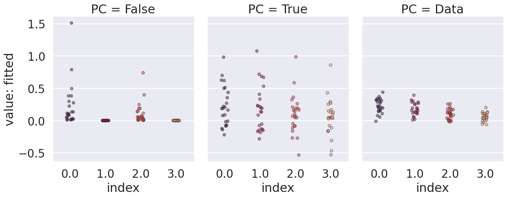

-   [base-train](#base-train)
    -   [search init_std](#search-init_std)
-   [base-train-fc](#base-train-fc)

# base-train

```bash
python main.py -c nature_coin_fig3_new/base-train
```

```bash
python analysis_v1.py \
-t "base-train-best_fit" \
-l "$RESULTS_DIR/nature_coin_fig3_new/" \
-m "eval(df['value-along-index'].iloc[-1])" \
-f "./experiments/nature_coin_fig3_new/base-train.yaml" \
-v \
"import experiments.nature_coin_fig3_new.utils as eu" \
"eu.fit_data_and_plot(df)"
```



```bash
python analysis_v1.py \
-t "base-train-best_fit-strip" \
-l "$RESULTS_DIR/nature_coin_fig3_new/" \
-m "eval(df['value-along-index'].iloc[-1])" \
-f "./experiments/nature_coin_fig3_new/base-train.yaml" \
--fig-name fig5-f \
--source-include-columns seed PC index "value: fitted" \
--source-columns-rename '{"PC": "PC (True) / BP (False) / Data (Data)", "index": "group", "value: fitted": "| Change of adaptation |"}' \
-v \
"import experiments.nature_coin_fig3_new.utils as eu" \
"df=eu.fit_data_and_plot(df,kind='strip')"
```



| PC    | value: mean over mean_columns: fitting_error | init_std |    lr | memory_lr |
| :---- | -------------------------------------------: | -------: | ----: | --------: |
| False |                                    0.0358361 |    1e-05 |   0.1 |     0.001 |
| True  |                                  0.000244306 |      0.1 | 5e-05 |      0.01 |

## search init_std

Watch out the best fit results from different groups are all in the search range.

```bash
python analysis_v1.py \
-t "base-train-init_std-best_fit" \
-l "$RESULTS_DIR/nature_coin_fig3_new/" \
-m "eval(df['value-along-index'].iloc[-1])" \
-f "./experiments/nature_coin_fig3_new/base-train.yaml" \
-g 'init_std' \
-v \
"import experiments.nature_coin_fig3_new.utils as eu" \
"eu.fit_data_and_plot(df)"
```

[doc](./base-train-init_std-best_fit.md)

```bash
python analysis_v1.py \
-t "base-train-init_std-best_fit-strip" \
-l "$RESULTS_DIR/nature_coin_fig3_new/" \
-m "eval(df['value-along-index'].iloc[-1])" \
-f "./experiments/nature_coin_fig3_new/base-train.yaml" \
-g 'init_std' \
-v \
"import experiments.nature_coin_fig3_new.utils as eu" \
"eu.fit_data_and_plot(df,kind='strip')"
```

[doc](./base-train-init_std-best_fit-strip.md)

# base-train-fc

Look at if fc with first layer also works, i.e., there are connections from R to hidden B and B to hidden R.

Also look at larger hidden size.

```bash
# done: veryfied fc with 2 hidden size and small number of seeds with fc works
# done: add hidden size and test with seeds
# done: add back rest of seeds
python main.py -c nature_coin_fig3_new/base-train-fc
```

```bash
python analysis_v1.py \
-t "base-train-fc-best_fit" \
-l "$RESULTS_DIR/nature_coin_fig3_new/" \
-m "eval(df['value-along-index'].iloc[-1])" \
-f "./experiments/nature_coin_fig3_new/base-train-fc.yaml" \
-g 'is_fc' 'hidden_size' \
-v \
"import experiments.nature_coin_fig3_new.utils as eu" \
"eu.fit_data_and_plot(df, kind='strip')"
```

[doc](./base-train-fc-best_fit.md)
