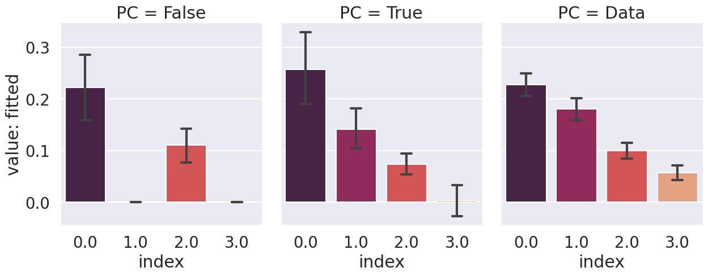
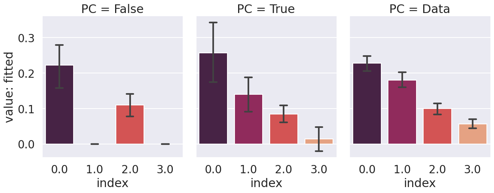
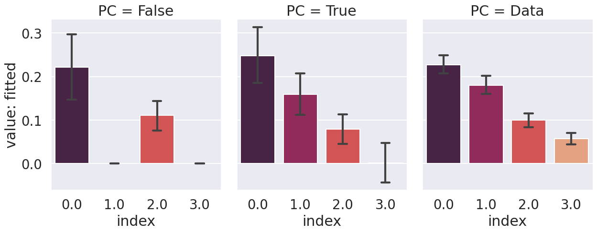
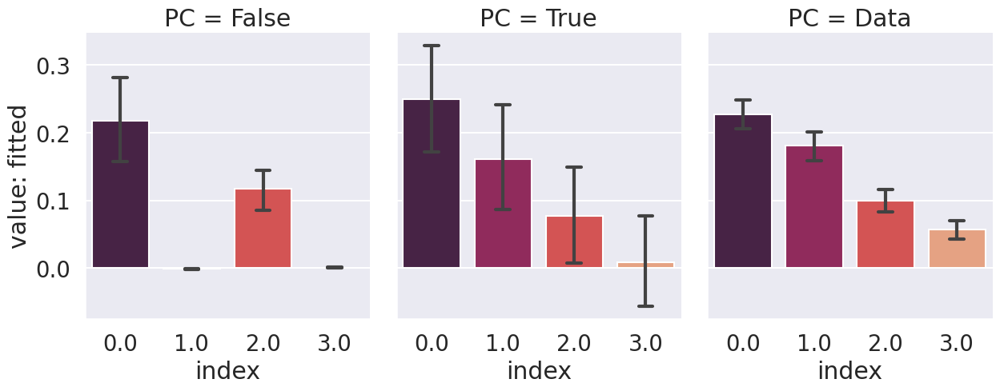
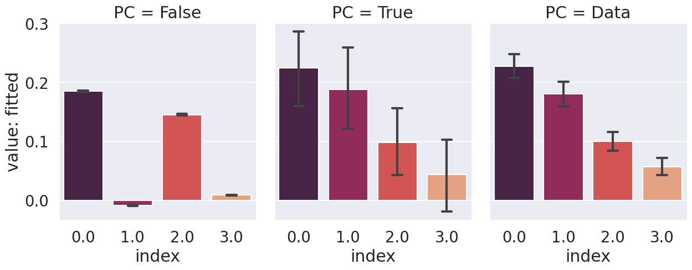

# Figures

| 'init_std': 1e-05                             | 'init_std': 0.0001                             | 'init_std': 0.001                             | 'init_std': 0.01                             | 'init_std': 0.1                             |
|:----------------------------------------------|:-----------------------------------------------|:----------------------------------------------|:---------------------------------------------|:--------------------------------------------|
|  |  |  |  |  |
