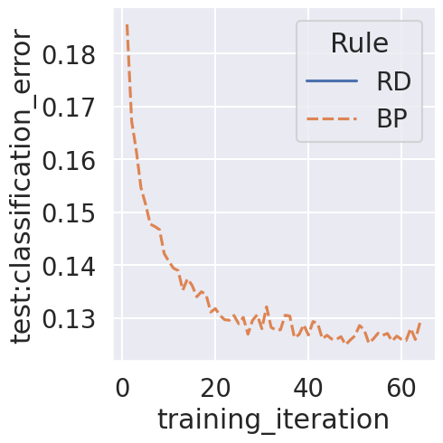
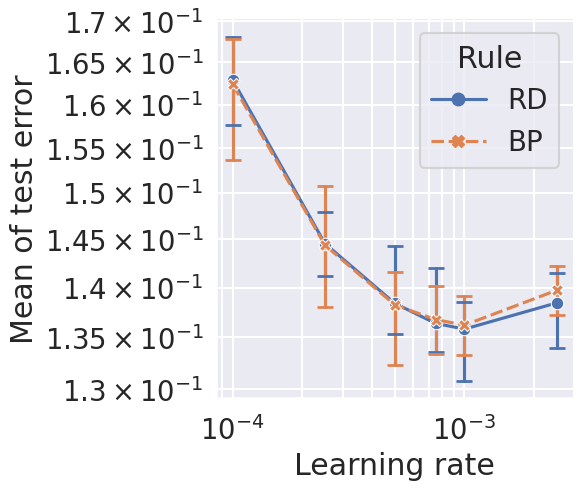
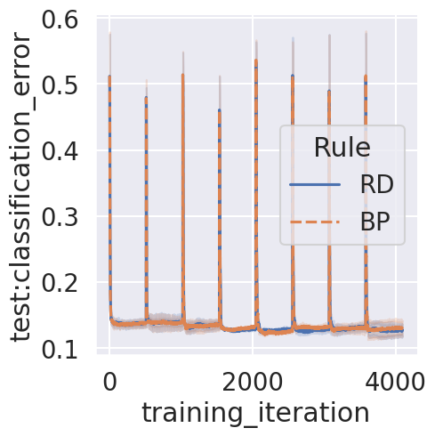
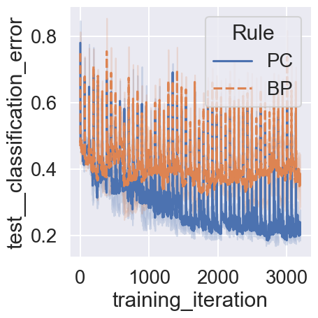
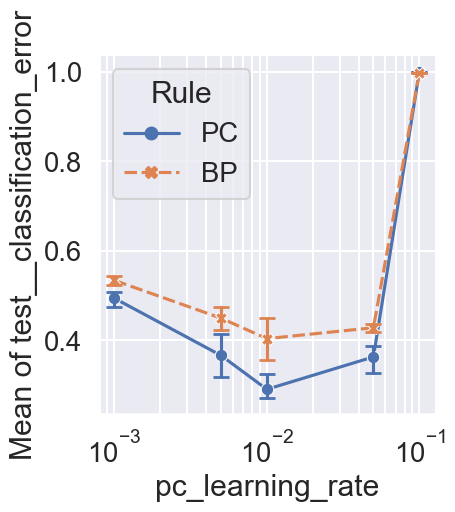

<!-- TOC -->

-   [pre-FashionMNIST](#pre-fashionmnist)
-   [base-FashionMNIST](#base-fashionmnist)
    -   [mean-FashionMNIST](#mean-fashionmnist)
    -   [curve-FashionMNIST](#curve-fashionmnist)
-   [pre](#pre)
-   [base](#base)
    -   [mean (nature)](#mean-nature)

<!-- /TOC -->

<!-- # pre-FashionMNIST

```bash
/* master */
CUDA_VISIBLE_DEVICES=0 ray job submit --runtime-env runtime_envs/runtime_env_without_ip.yaml --address $pssr -- python main.py -c nature_concept_drift/pre-FashionMNIST
```

```bash
python analysis_v1.py \
-t "curve-pre-FashionMNIST" \
-l "$RESULTS_DIR/nature_concept_drift/" \
-m "compress_plot('test__classification_error','training_iteration')" "df['test__classification_error'].mean()" \
-f "./experiments/nature_concept_drift/pre-FashionMNIST.yaml" \
-v \
"import experiments.nature_concept_drift.utils as u" \
"u.plot_curve(df)"
```



# base-FashionMNIST

```bash
/* master */
CUDA_VISIBLE_DEVICES=1,2,3 ray job submit --runtime-env runtime_envs/runtime_env_without_ip.yaml --address $pssr -- python main.py -c nature_concept_drift/base-FashionMNIST -m T1
python split_config.py -c nature_concept_drift/base-FashionMNIST -m dgx
```

## mean-FashionMNIST

```bash
python analysis_v1.py \
-t "mean-FashionMNIST" \
-l "$RESULTS_DIR/nature_concept_drift/" \
-m "df['test__classification_error'].mean()" \
-f "./experiments/nature_concept_drift/base-FashionMNIST.yaml" \
-v \
"import experiments.nature_concept_drift.utils as u" \
"u.plot(df)"
```



## curve-FashionMNIST

```bash
python analysis_v1.py \
-t "curve-FashionMNIST" \
-l "$RESULTS_DIR/nature_concept_drift/" \
-m "compress_plot('test__classification_error','training_iteration')" "df['test__classification_error'].mean()" \
-f "./experiments/nature_concept_drift/base-FashionMNIST.yaml" \
-v \
"import experiments.nature_concept_drift.utils as u" \
"u.plot_curve_best(df, config_columns)"
```

 -->

<!-- # pre

```bash
ray job submit --runtime-env runtime_envs/runtime_env_without_ip.yaml --address $pssr -- python main.py -c nature_concept_drift/pre
``` -->

# base

```bash
python main.py -c nature_concept_drift/pre-FashionMNIST
```

```bash
ray job submit --runtime-env runtime_envs/runtime_env_without_ip.yaml --address $pssr -- python main.py -c nature_concept_drift/base
```

## curve

```bash
python analysis_v1.py \
-t "curve" \
-l "$RESULTS_DIR/nature_concept_drift/" \
-m "compress_plot('test__classification_error','training_iteration')" \
-f "./experiments/nature_concept_drift/base.yaml" \
--fig-name fig4-f \
--source-include-columns training_iteration Rule seed test__classification_error \
-v \
"df=au.nature_pre(df)" \
"df=pd.concat([au.filter_dataframe_by_dict(df,{'Rule':'PC','pc_learning_rate':0.01}),au.filter_dataframe_by_dict(df,{'Rule':'BP','pc_learning_rate':0.01})])" \
"df=au.extract_plot(df,'test__classification_error','training_iteration')" \
"g=au.nature_relplot_curve(data=df,x='training_iteration',y='test__classification_error',hue='Rule',style='Rule',aspect=1.5)" \
"au.nature_post(g,is_grid=False)"
```



## mean (nature)

```bash
python analysis_v1.py \
-t "mean" \
-l "$RESULTS_DIR/nature_concept_drift/" \
-m "df['test__classification_error'].mean()" \
-f "./experiments/nature_concept_drift/base.yaml" \
--fig-name fig4-g \
--source-include-columns pc_learning_rate Rule "Mean of test__classification_error" seed \
--source-columns-rename '{"pc_learning_rate": "learning rate"}' \
-v \
"df=au.nature_pre(df)" \
"g=au.nature_relplot(data=df,x='pc_learning_rate',y='Mean of test__classification_error',hue='Rule',style='Rule').set(xscale='log')" \
"au.nature_post(g,is_grid=True)"
```



<!-- ## curve-weight_norm

```bash
python analysis_v1.py \
-t "curve-weight_norm" \
-l "$RESULTS_DIR/nature_concept_drift/" \
-m "compress_plot('test__weight_norm','training_iteration')" \
-f "./experiments/nature_concept_drift/base.yaml" \
-v \
"df=au.nature_pre(df)" \
"df=pd.concat([au.filter_dataframe_by_dict(df,{'Rule':'PC','pc_learning_rate':0.01}),au.filter_dataframe_by_dict(df,{'Rule':'BP','pc_learning_rate':0.01})])" \
"df=au.extract_plot(df,'test__weight_norm','training_iteration')" \
"g=au.nature_relplot_curve(data=df,x='training_iteration',y='test__weight_norm',hue='Rule',style='Rule')" \
"au.nature_post(g,is_grid=False)"
```

 -->
