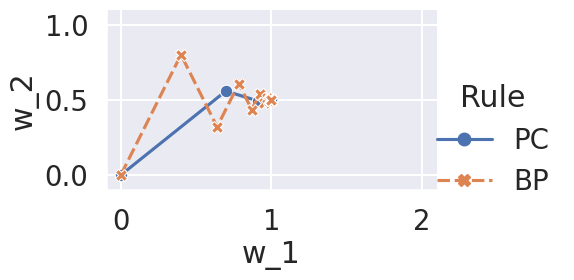

-   [Base](#base)
-   [With small learning rate](#with-small-learning-rate)

# Base

```bash
python main.py -c nature_example_122/traj-bp
python main.py -c nature_example_122/traj-pc
```

```bash
python analysis_v1.py \
-t "plot-traj" \
-l "$RESULTS_DIR/nature_example_122/" \
-m "df['train__w_1'].iloc[-1]" "df['train__w_2'].iloc[-1]" \
-f "./experiments/nature_example_122/traj-bp.yaml" "./experiments/nature_example_122/traj-pc.yaml" \
-v \
"import experiments.nature_example_122.utils as u" \
"u.plot_traj(df)"
```



```bash
python main.py -c nature_example_122/traj-output-bp
python main.py -c nature_example_122/traj-output-pc
```

```bash
python analysis_v1.py \
-t "plot-traj-output" \
-l "$RESULTS_DIR/nature_example_122/" \
-m "df['train__x_1'].iloc[-1]" "df['train__x_2'].iloc[-1]" \
-f "./experiments/nature_example_122/traj-output-bp.yaml" "./experiments/nature_example_122/traj-output-pc.yaml" \
-v \
"import experiments.nature_example_122.utils as u" \
"u.plot_traj(df,id='x')"
```


# With small learning rate

```bash
python main.py -c nature_example_122/traj-small-lr-bp
python main.py -c nature_example_122/traj-small-lr-pc
```

```bash
python analysis_v1.py \
-t "plot-traj-small-lr" \
-l "$RESULTS_DIR/nature_example_122/" \
-m "df['train__w_1'].iloc[-1]" "df['train__w_2'].iloc[-1]" \
-f "./experiments/nature_example_122/traj-small-lr-bp.yaml" "./experiments/nature_example_122/traj-small-lr-pc.yaml" \
-v \
"import experiments.nature_example_122.utils as u" \
"u.plot_traj(df,is_style_rule=False)"
```


```bash
python main.py -c nature_example_122/traj-small-lr-output-bp
python main.py -c nature_example_122/traj-small-lr-output-pc
```

```bash
python analysis_v1.py \
-t "plot-traj-small-lr-output" \
-l "$RESULTS_DIR/nature_example_122/" \
-m "df['train__x_1'].iloc[-1]" "df['train__x_2'].iloc[-1]" \
-f "./experiments/nature_example_122/traj-small-lr-output-bp.yaml" "./experiments/nature_example_122/traj-small-lr-output-pc.yaml" \
-v \
"import experiments.nature_example_122.utils as u" \
"u.plot_traj(df,id='x',is_style_rule=False)"
```


