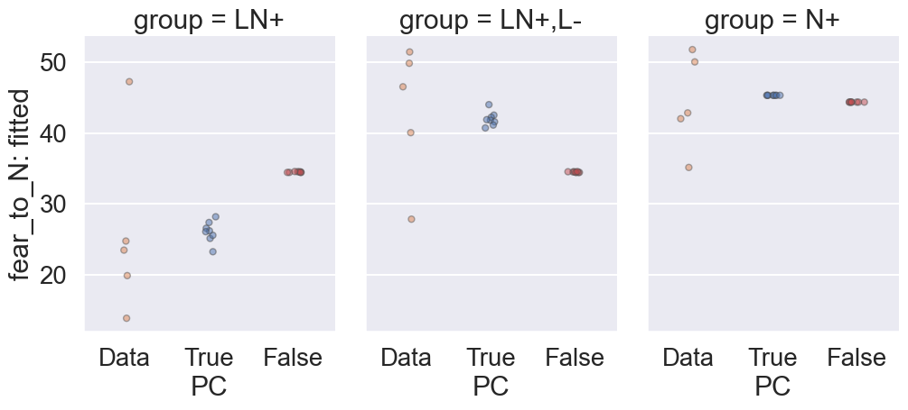
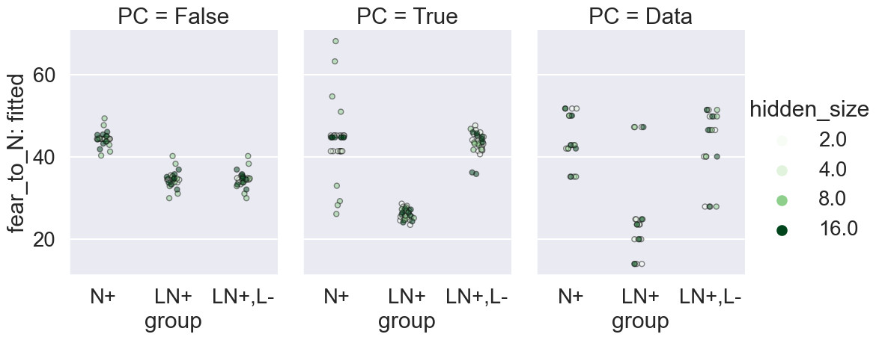

- [base](#base)
- [init\_std](#init_std)

<!-- # base

```bash
# done
python main.py -c nature_fear_conditioning/base
```

```bash
# done
python analysis_v1.py \
-t "base" \
-l "$RESULTS_DIR/nature_fear_conditioning/" \
-m "df['extinction__fear_to_N'].iloc[-1]" \
-f "./experiments/nature_fear_conditioning/base.yaml" \
-g 'init_std' \
-v \
"import experiments.nature_fear_conditioning.utils as eu" \
"eu.fit_data_and_plot(df)"
```

[doc](./base.md)

```bash
# done
python analysis_v1.py \
-t "base-strip" \
-l "$RESULTS_DIR/nature_fear_conditioning/" \
-m "df['extinction__fear_to_N'].iloc[-1]" \
-f "./experiments/nature_fear_conditioning/base.yaml" \
-g 'init_std' \
-v \
"import experiments.nature_fear_conditioning.utils as eu" \
"eu.fit_data_and_plot(df,'strip')"
```

[doc](./base-strip.md)

'init_std'__ 0.01 works and is what we need to update the paper. -->

# base

```bash
python analysis_v1.py \
-t "base" \
-l "$RESULTS_DIR/nature_fear_conditioning/" \
-m "df['extinction__fear_to_N'].iloc[-1]" \
-f "./experiments/nature_fear_conditioning/base.yaml" \
-v \
"import experiments.nature_fear_conditioning.utils as eu" \
"eu.fit_data_and_plot(df,'strip')"
```



# init_std

More init_std for the response of nature neuroscience

```bash
ray job submit --runtime-env runtime_envs/runtime_env_without_ip.yaml --address $PSSR --  python main.py -c nature_fear_conditioning/base-init_std
```

```bash
python analysis_v1.py \
-t "base-init_std" \
-l "$RESULTS_DIR/nature_fear_conditioning/" \
-m "df['extinction__fear_to_N'].iloc[-1]" \
-f "./experiments/nature_fear_conditioning/base-init_std.yaml" \
-v \
"import experiments.nature_fear_conditioning.utils as eu" \
"eu.fit_data_and_plot_init_std(df, kind='box')"
```


<!-- # hidden size

More hidden neurons for the response of nature neuroscience

```bash
ray job submit --runtime-env runtime_envs/runtime_env_without_ip.yaml --address $PSSR --  python main.py -c nature_fear_conditioning/base-hidden_size
```

```bash
python analysis_v1.py \
-t "base-hidden_size" \
-l "$RESULTS_DIR/nature_fear_conditioning/" \
-m "df['extinction__fear_to_N'].iloc[-1]" \
-f "./experiments/nature_fear_conditioning/base-hidden_size.yaml" \
-v \
"import experiments.nature_fear_conditioning.utils as eu" \
"eu.fit_data_and_plot_hidden_size(df,is_has_is_fc=False,kind='strip')"
```



## hidden size with fully connected input to hidden and hidden to output

```bash
# pending: look at small net all search
python main.py -c nature_fear_conditioning/base-hidden_size-fc
# todo: add seed and others back to formal experiment
# todo: add hidden size back to formal experiment

# done
python analysis_v1.py \
-t "base-hidden_size-fc" \
-l "$RESULTS_DIR/nature_fear_conditioning/" \
-m "df['extinction__fear_to_N'].iloc[-1]" \
-f "./experiments/nature_fear_conditioning/base-hidden_size-fc.yaml" \
-v \
"import experiments.nature_fear_conditioning.utils as eu" \
"eu.fit_data_and_plot_hidden_size(df)"

```

 -->
