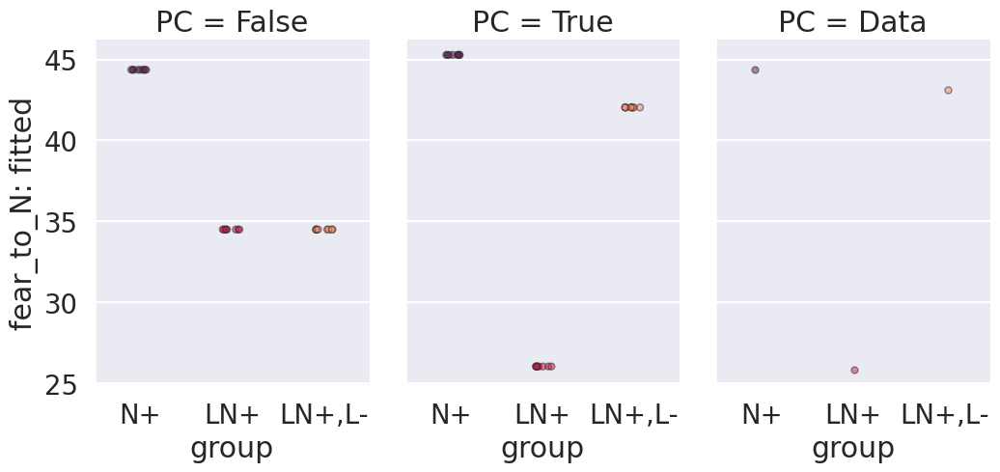
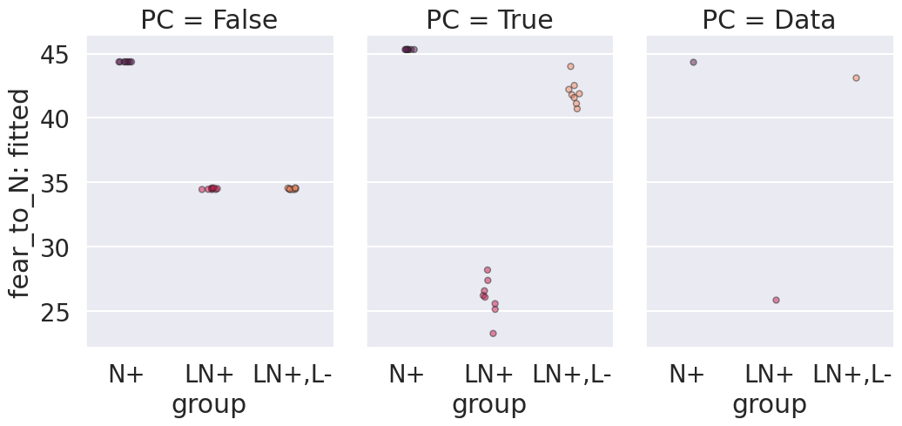
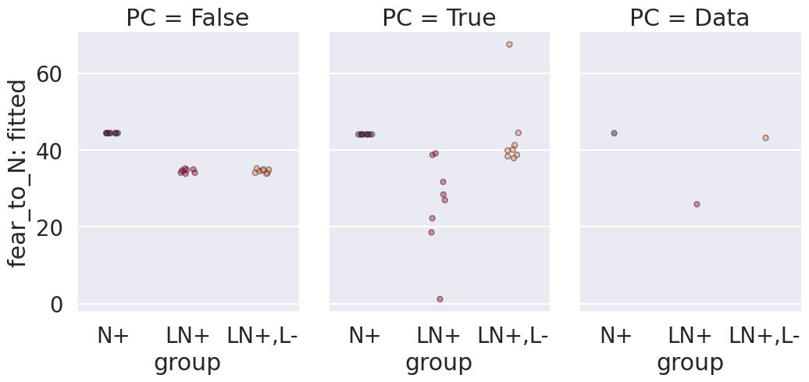

# Figures

| 'init_std': 1e-08           | 'init_std': 1e-05           | 'init_std': 0.01           | 'init_std': 0.1           |
|:----------------------------|:----------------------------|:---------------------------|:--------------------------|
|  |  |  |  |
