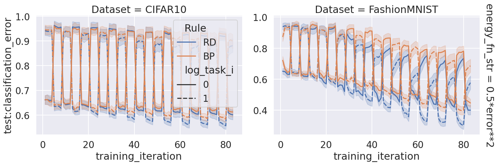

-   [base-shuffle-task-5](#base-shuffle-task-5)
    -   [mean](#mean)
    -   [plot](#plot)

<!-- # base

```bash
ray job submit --runtime-env runtime_envs/runtime_env_without_ip.yaml --address $pssr -- python main.py -c nature_forgetting/base
```

## mean

```bash
python analysis_v1.py \
-p "sns.set_theme()" \
-t "mean" \
-l "$RESULTS_DIR/nature_forgetting/" \
-m "df['test__classification_error'].mean()" \
-f "./experiments/nature_forgetting/base.yaml" \
-g "block_error_unused_output" "share_output_across_tasks" "batch_size" \
-v \
"import experiments.nature_forgetting.utils as u" \
"u.plot_mean(df)"
```

[doc](./mean.md)

## plot

```bash
python analysis_v1.py \
-p "sns.set_theme()" \
-t "plot" \
-l "$RESULTS_DIR/nature_forgetting/" \
-m "compress_plot('test__classification_error','training_iteration')" "df['test__classification_error'].mean()" \
-f "./experiments/nature_forgetting/base.yaml" \
-g "block_error_unused_output" "share_output_across_tasks" "batch_size" \
-v \
"import experiments.nature_forgetting.utils as u" \
"u.plot(df)"
```

[doc](./plot.md)

'block_error_unused_output': False, 'share_output_across_tasks': True, 'batch_size': 60 is the best, focusing on these configs

# base-1

```bash
ray job submit --runtime-env runtime_envs/runtime_env_without_ip.yaml --address $pssr -- python main.py -c nature_forgetting/base-1
```

## mean

```bash
python analysis_v1.py \
-p "sns.set_theme()" \
-t "base-1-mean" \
-l "$RESULTS_DIR/nature_forgetting/" \
-m "df['test__classification_error'].mean()" \
-f "./experiments/nature_forgetting/base-1.yaml" \
-g "block_error_unused_output" "share_output_across_tasks" "batch_size" \
-v \
"import experiments.nature_forgetting.utils as u" \
"u.plot_mean(df)"
```

[doc](./base-1-mean.md)

## plot

```bash
python analysis_v1.py \
-p "sns.set_theme()" \
-t "base-1-plot" \
-l "$RESULTS_DIR/nature_forgetting/" \
-m "compress_plot('test__classification_error','training_iteration')" "df['test__classification_error'].mean()" \
-f "./experiments/nature_forgetting/base-1.yaml" \
-g "block_error_unused_output" "share_output_across_tasks" "batch_size" \
-v \
"import experiments.nature_forgetting.utils as u" \
"u.plot(df)"
```

[doc](./base-1-plot.md)

'batch_size': 500 has most significant difference between RD and BP

# base-2

```bash
ray job submit --runtime-env runtime_envs/runtime_env_without_ip.yaml --address $pssr -- python main.py -c nature_forgetting/base-2
```

## mean

```bash
python analysis_v1.py \
-p "sns.set_theme()" \
-t "base-2-mean" \
-l "$RESULTS_DIR/nature_forgetting/" \
-m "df['test__classification_error'].mean()" \
-f "./experiments/nature_forgetting/base-2.yaml" \
-g "block_error_unused_output" "share_output_across_tasks" "batch_size" "num_repeatations" \
-v \
"import experiments.nature_forgetting.utils as u" \
"u.plot_mean(df)"
```

[doc](./base-2-mean.md)

## plot

```bash
python analysis_v1.py \
-p "sns.set_theme()" \
-t "base-2-plot" \
-l "$RESULTS_DIR/nature_forgetting/" \
-m "compress_plot('test__classification_error','training_iteration')" "df['test__classification_error'].mean()" \
-f "./experiments/nature_forgetting/base-2.yaml" \
-g "block_error_unused_output" "share_output_across_tasks" "batch_size" "num_repeatations" \
-v \
"import experiments.nature_forgetting.utils as u" \
"u.plot(df)"
```

[doc](./base-2-plot.md)

Shuffle task to cancel bias across task selection.

# base-shuffle-task

```bash
ray job submit --runtime-env runtime_envs/runtime_env_without_ip.yaml --address $pssr -- python main.py -c nature_forgetting/base-shuffle-task
```

## mean

```bash
python analysis_v1.py \
-p "sns.set_theme()" \
-t "base-shuffle-task-mean" \
-l "$RESULTS_DIR/nature_forgetting/" \
-m "df['test__classification_error'].mean()" \
-f "./experiments/nature_forgetting/base-shuffle-task.yaml" \
-g "block_error_unused_output" "share_output_across_tasks" "batch_size" "num_repeatations" \
-v \
"import experiments.nature_forgetting.utils as u" \
"u.plot_mean(df)"
```

[doc](./base-shuffle-task-mean.md)

## plot

```bash
python analysis_v1.py \
-p "sns.set_theme()" \
-t "base-shuffle-task-plot" \
-l "$RESULTS_DIR/nature_forgetting/" \
-m "compress_plot('test__classification_error','training_iteration')" "df['test__classification_error'].mean()" \
-f "./experiments/nature_forgetting/base-shuffle-task.yaml" \
-g "block_error_unused_output" "share_output_across_tasks" "batch_size" "num_repeatations" \
-v \
"import experiments.nature_forgetting.utils as u" \
"u.plot(df)"
```

[doc](./base-shuffle-task-plot.md)

# base-shuffle-task-1

```bash
ray job submit --runtime-env runtime_envs/runtime_env_without_ip.yaml --address $pssr -- python main.py -c nature_forgetting/base-shuffle-task-1
```

## mean

```bash
python analysis_v1.py \
-p "sns.set_theme()" \
-t "base-shuffle-task-1-mean" \
-l "$RESULTS_DIR/nature_forgetting/" \
-m "df['test__classification_error'].mean()" \
-f "./experiments/nature_forgetting/base-shuffle-task-1.yaml" \
-g "block_error_unused_output" "share_output_across_tasks" "batch_size" "num_repeatations" \
-v \
"import experiments.nature_forgetting.utils as u" \
"u.plot_mean(df)"
```

[doc](./base-shuffle-task-1-mean.md)

## plot

```bash
python analysis_v1.py \
-p "sns.set_theme()" \
-t "base-shuffle-task-1-plot" \
-l "$RESULTS_DIR/nature_forgetting/" \
-m "compress_plot('test__classification_error','training_iteration')" "df['test__classification_error'].mean()" \
-f "./experiments/nature_forgetting/base-shuffle-task-1.yaml" \
-g "block_error_unused_output" "share_output_across_tasks" "batch_size" "num_repeatations" \
-v \
"import experiments.nature_forgetting.utils as u" \
"u.plot(df)"
```

[doc](./base-shuffle-task-1-plot.md)

- 'block_error_unused_output': False, 'share_output_across_tasks': True, 'batch_size': 500, 'num_repeatations': 4
- 'block_error_unused_output': False, 'share_output_across_tasks': True, 'batch_size': 500, 'num_repeatations': 20

These two looks nice, keep going.

# base-shuffle-task-2

- 'batch_size': 500, 'num_repeatations': 4

I feel this one is most appropriate.

```bash
CUDA_VISIBLE_DEVICES=1,2,3 ray job submit --runtime-env runtime_envs/runtime_env_without_ip.yaml --address $pssr -- python main.py -c nature_forgetting/base-shuffle-task-2
```

## mean

```bash
python analysis_v1.py \
-p "sns.set_theme()" \
-t "base-shuffle-task-2-mean" \
-l "$RESULTS_DIR/nature_forgetting/" \
-m "df['test__classification_error'].mean()" \
-f "./experiments/nature_forgetting/base-shuffle-task-2.yaml" \
-g "block_error_unused_output" "share_output_across_tasks" "batch_size" "num_repeatations" "partial_num" \
-v \
"import experiments.nature_forgetting.utils as u" \
"u.plot_mean(df)"
```

[doc](./base-shuffle-task-2-mean.md)

## plot

```bash
python analysis_v1.py \
-p "sns.set_theme()" \
-t "base-shuffle-task-2-plot" \
-l "$RESULTS_DIR/nature_forgetting/" \
-m "compress_plot('test__classification_error','training_iteration')" "df['test__classification_error'].mean()" \
-f "./experiments/nature_forgetting/base-shuffle-task-2.yaml" \
-g "block_error_unused_output" "share_output_across_tasks" "batch_size" "num_repeatations" "partial_num" \
-v \
"import experiments.nature_forgetting.utils as u" \
"u.plot(df)"
```

[doc](./base-shuffle-task-2-plot.md)

# base-shuffle-task-3

'partial_num': 600 for FashionMNIST
'partial_num': 6000 for CIFAR10

```bash
CUDA_VISIBLE_DEVICES=1 ray job submit --runtime-env runtime_envs/runtime_env_without_ip.yaml --address $pssr -- python main.py -c nature_forgetting/base-shuffle-task-3-FashionMNIST
CUDA_VISIBLE_DEVICES=3 ray job submit --runtime-env runtime_envs/runtime_env_without_ip.yaml --address $pssr -- python main.py -c nature_forgetting/base-shuffle-task-3-CIFAR10
```

## mean

```bash
python analysis_v1.py \
-t "base-shuffle-task-3-mean" \
-l "$RESULTS_DIR/nature_forgetting/" \
-m "df['test__classification_error'].mean()" \
-f "./experiments/nature_forgetting/base-shuffle-task-3-FashionMNIST.yaml" "./experiments/nature_forgetting/base-shuffle-task-3-CIFAR10.yaml" \
-g "block_error_unused_output" "share_output_across_tasks" "batch_size" "num_repeatations" \
-v \
"import experiments.nature_forgetting.utils as u" \
"u.plot_mean_shuffle_task_3(df)"
```

[doc](./base-shuffle-task-3-mean.md)

## plot

```bash
python analysis_v1.py \
-t "base-shuffle-task-3-plot" \
-l "$RESULTS_DIR/nature_forgetting/" \
-m "compress_plot('test__classification_error','training_iteration')" "df['test__classification_error'].mean()" \
-f "./experiments/nature_forgetting/base-shuffle-task-3-FashionMNIST.yaml" "./experiments/nature_forgetting/base-shuffle-task-3-CIFAR10.yaml" \
-g "block_error_unused_output" "share_output_across_tasks" "batch_size" "num_repeatations" \
-v \
"import experiments.nature_forgetting.utils as u" \
"u.plot_shuffle_task_3(df)"
```

[doc](./base-shuffle-task-3-plot.md)

# base-shuffle-task-4

looking at both 'num_repeatations': 20 and 4

```bash
ray job submit --runtime-env runtime_envs/runtime_env_without_ip.yaml --address $pssr -- python main.py -c nature_forgetting/base-shuffle-task-4-FashionMNIST
CUDA_VISIBLE_DEVICES=0,3 ray job submit --runtime-env runtime_envs/runtime_env_without_ip.yaml --address $pssr -- python main.py -c nature_forgetting/base-shuffle-task-4-CIFAR10
```

## mean

```bash
python analysis_v1.py \
-t "base-shuffle-task-4-mean" \
-l "$RESULTS_DIR/nature_forgetting/" \
-m "df['test__classification_error'].mean()" \
-f "./experiments/nature_forgetting/base-shuffle-task-4-FashionMNIST.yaml" "./experiments/nature_forgetting/base-shuffle-task-4-CIFAR10.yaml" \
-g "block_error_unused_output" "share_output_across_tasks" "batch_size" "num_repeatations" \
-v \
"import experiments.nature_forgetting.utils as u" \
"u.plot_mean_shuffle_task_3(df)"
```

[doc](./base-shuffle-task-4-mean.md)

## plot

```bash
python analysis_v1.py \
-t "base-shuffle-task-4-plot" \
-l "$RESULTS_DIR/nature_forgetting/" \
-m "compress_plot('test__classification_error','training_iteration')" "df['test__classification_error'].mean()" \
-f "./experiments/nature_forgetting/base-shuffle-task-4-FashionMNIST.yaml" "./experiments/nature_forgetting/base-shuffle-task-4-CIFAR10.yaml" \
-g "block_error_unused_output" "share_output_across_tasks" "batch_size" "num_repeatations" \
-v \
"import experiments.nature_forgetting.utils as u" \
"u.plot_shuffle_task_3(df)"
```

[doc](./base-shuffle-task-4-plot.md) -->

# base-shuffle-task-5

forcus on 'num_repeatations': 20 for publication

```bash
ray job submit --runtime-env runtime_envs/runtime_env_without_ip.yaml --address $pssr -- python main.py -c nature_forgetting/base-shuffle-task-5-FashionMNIST
# ray job submit --runtime-env runtime_envs/runtime_env_without_ip.yaml --address $pssr -- python main.py -c nature_forgetting/base-shuffle-task-5-CIFAR10
```

## mean

```bash
python analysis_v1.py \
-t "base-shuffle-task-5-mean" \
-l "$RESULTS_DIR/nature_forgetting/" \
-m "df['test__classification_error'][:84].mean()" \
-f "./experiments/nature_forgetting/base-shuffle-task-5-FashionMNIST.yaml" \
-g "block_error_unused_output" "share_output_across_tasks" "batch_size" "num_repeatations" \
--fig-name fig4-e \
--source-include-columns pc_learning_rate Rule "Mean of test__classification_error" seed \
--source-columns-rename '{"pc_learning_rate": "learning rate"}' \
-v \
"import experiments.nature_forgetting.utils as u" \
"u.plot_mean_shuffle_task_5(df)"
```

<!-- [doc](./base-shuffle-task-5-mean.md) -->


## plot

```bash
python analysis_v1.py \
-t "base-shuffle-task-5-plot" \
-l "$RESULTS_DIR/nature_forgetting/" \
-m "compress_plot('test__classification_error','training_iteration')" "df['test__classification_error'][:84].mean()" \
-f "./experiments/nature_forgetting/base-shuffle-task-5-FashionMNIST.yaml" \
-g "block_error_unused_output" "share_output_across_tasks" "batch_size" "num_repeatations" \
--fig-name fig4-d \
--source-include-columns training_iteration Rule "test__classification_error" seed log_task_i \
--source-columns-rename '{"pc_learning_rate": "learning rate", "log_task_i": "Test error of"}' \
-v \
"import experiments.nature_forgetting.utils as u" \
"df=u.plot_shuffle_task_5(df)"
```

<!-- [doc](./base-shuffle-task-5-plot.md) -->



<!-- ## mean-fr

split by resuming and nature_forgetting

```bash
ray job submit --runtime-env runtime_envs/runtime_env_without_ip.yaml --address $pssr -- python main.py -c nature_forgetting/base-shuffle-task-5-FashionMNIST-fr
ray job submit --runtime-env runtime_envs/runtime_env_without_ip.yaml --address $pssr -- python main.py -c nature_forgetting/base-shuffle-task-5-CIFAR10-fr
```

```bash
python analysis_v1.py \
-t "base-shuffle-task-5-mean-fr" \
-l "$RESULTS_DIR/nature_forgetting/" \
-m "df['test__classification_error'][:84].mean()" \
-f "./experiments/nature_forgetting/base-shuffle-task-5-FashionMNIST-fr.yaml" "./experiments/nature_forgetting/base-shuffle-task-5-CIFAR10-fr.yaml" \
-g "block_error_unused_output" "share_output_across_tasks" "batch_size" "num_repeatations" \
-v \
"import experiments.nature_forgetting.utils as u" \
"u.plot_mean_shuffle_task_5_fr(df)"
```

[doc](./base-shuffle-task-5-mean-fr.md) -->
