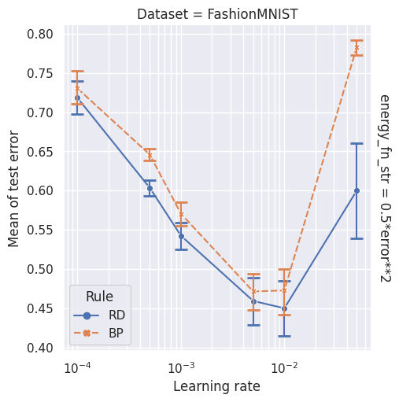
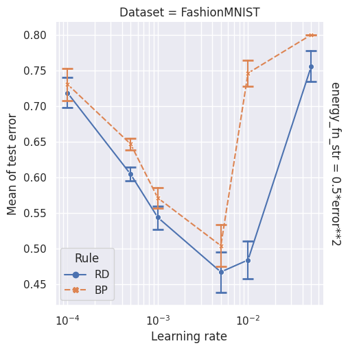
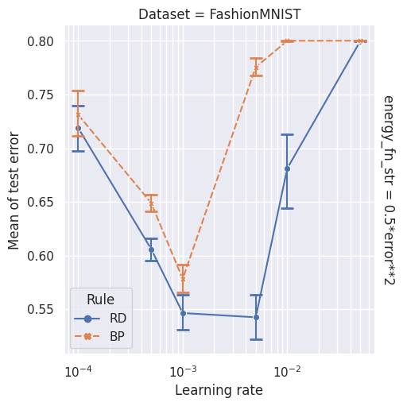
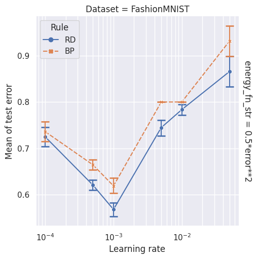
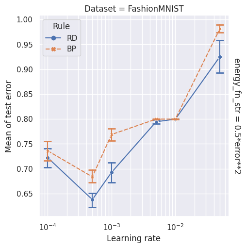

# Figures

| 'block_error_unused_output': False, 'share_output_across_tasks': True, 'batch_size': 30   | 'block_error_unused_output': False, 'share_output_across_tasks': True, 'batch_size': 60   | 'block_error_unused_output': False, 'share_output_across_tasks': True, 'batch_size': 120   | 'block_error_unused_output': False, 'share_output_across_tasks': True, 'batch_size': 240   | 'block_error_unused_output': False, 'share_output_across_tasks': True, 'batch_size': 500   |
|:------------------------------------------------------------------------------------------|:------------------------------------------------------------------------------------------|:-------------------------------------------------------------------------------------------|:-------------------------------------------------------------------------------------------|:-------------------------------------------------------------------------------------------|
|                                                       |                                                       |                                                       |                                                       |                                                       |
