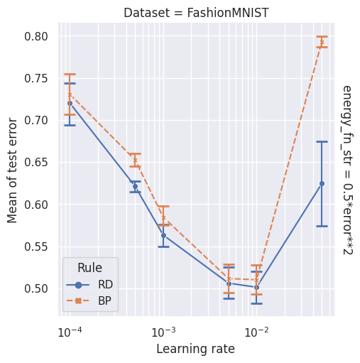
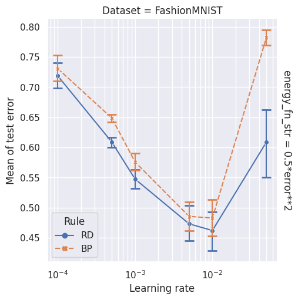
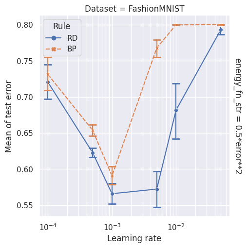
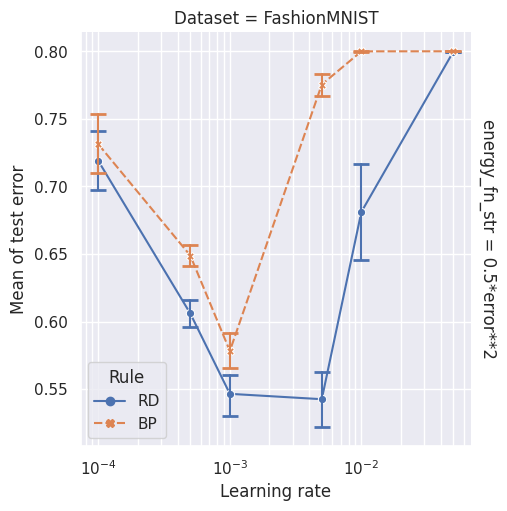
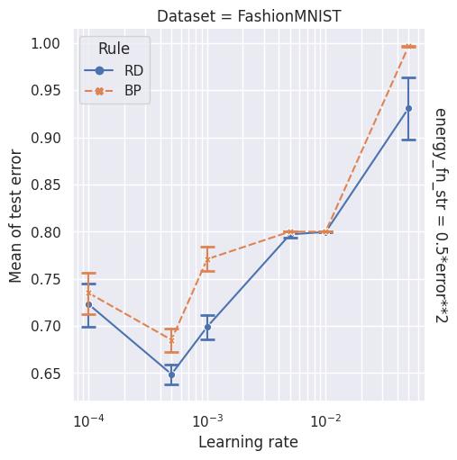
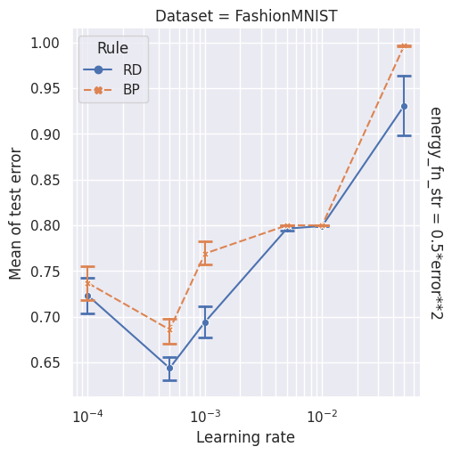
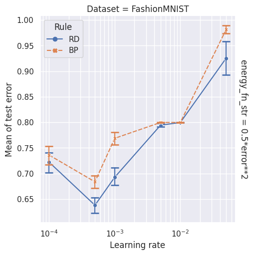

# Figures

| 'block_error_unused_output': False, 'share_output_across_tasks': True, 'batch_size': 30, 'num_repeatations': 2   | 'block_error_unused_output': False, 'share_output_across_tasks': True, 'batch_size': 30, 'num_repeatations': 10   | 'block_error_unused_output': False, 'share_output_across_tasks': True, 'batch_size': 30, 'num_repeatations': 40   | 'block_error_unused_output': False, 'share_output_across_tasks': True, 'batch_size': 120, 'num_repeatations': 2   | 'block_error_unused_output': False, 'share_output_across_tasks': True, 'batch_size': 120, 'num_repeatations': 10   | 'block_error_unused_output': False, 'share_output_across_tasks': True, 'batch_size': 120, 'num_repeatations': 40   | 'block_error_unused_output': False, 'share_output_across_tasks': True, 'batch_size': 500, 'num_repeatations': 2   | 'block_error_unused_output': False, 'share_output_across_tasks': True, 'batch_size': 500, 'num_repeatations': 10   | 'block_error_unused_output': False, 'share_output_across_tasks': True, 'batch_size': 500, 'num_repeatations': 40   |
|:-----------------------------------------------------------------------------------------------------------------|:------------------------------------------------------------------------------------------------------------------|:------------------------------------------------------------------------------------------------------------------|:------------------------------------------------------------------------------------------------------------------|:-------------------------------------------------------------------------------------------------------------------|:-------------------------------------------------------------------------------------------------------------------|:------------------------------------------------------------------------------------------------------------------|:-------------------------------------------------------------------------------------------------------------------|:-------------------------------------------------------------------------------------------------------------------|
|                                                                            |                                                                            |                                                                            |                                                                            |                                                                            |                                                                            |                                                                            |                                                                            |                                                                            |
