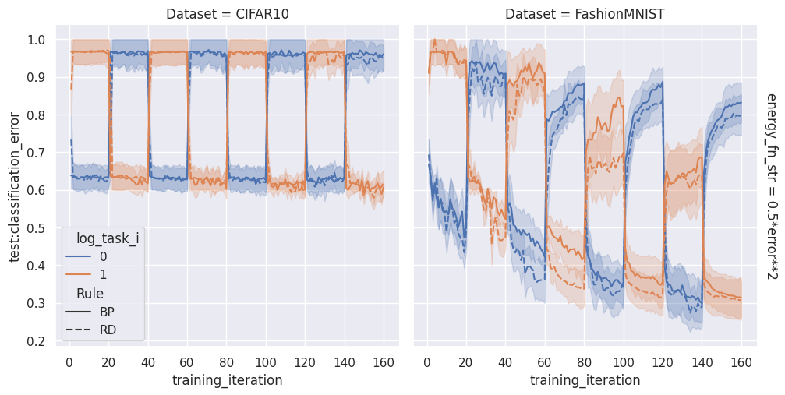
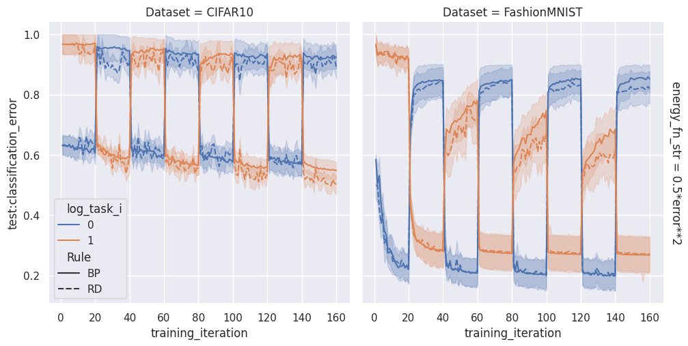

# Figures

| 'block_error_unused_output': False, 'share_output_across_tasks': True, 'batch_size': 500, 'num_repeatations': 4, 'partial_num': 600   | 'block_error_unused_output': False, 'share_output_across_tasks': True, 'batch_size': 500, 'num_repeatations': 4, 'partial_num': 6000   |
|:--------------------------------------------------------------------------------------------------------------------------------------|:---------------------------------------------------------------------------------------------------------------------------------------|
|                                                                               |                                                                               |
