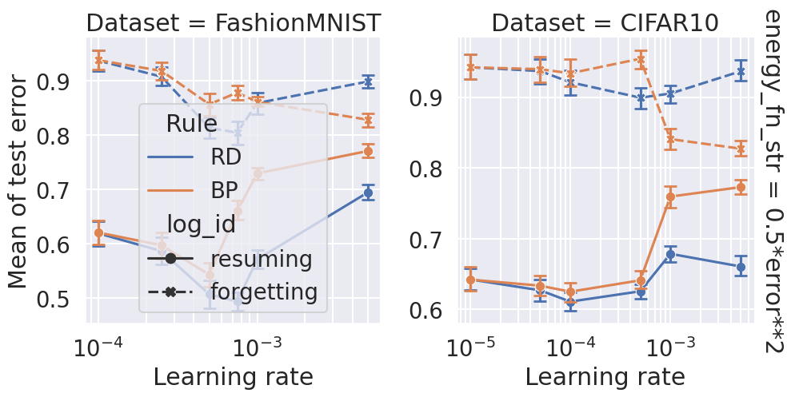

# Figures

| 'block_error_unused_output': False, 'share_output_across_tasks': True, 'batch_size': 500, 'num_repeatations': 11   |
|:-------------------------------------------------------------------------------------------------------------------|
|                                                            |
