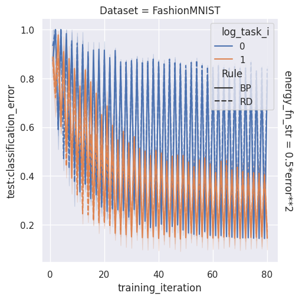
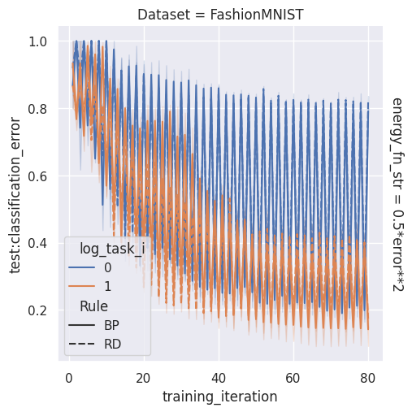
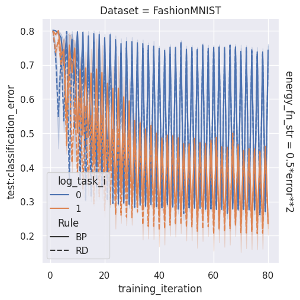
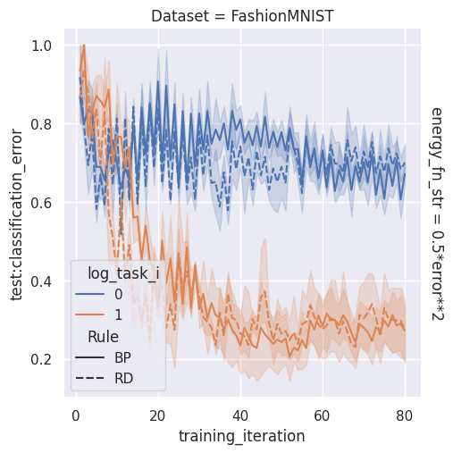
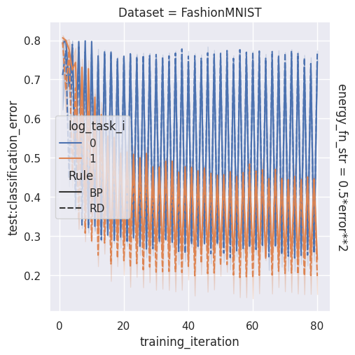

# Figures

| 'block_error_unused_output': False, 'share_output_across_tasks': False, 'batch_size': 30   | 'block_error_unused_output': False, 'share_output_across_tasks': False, 'batch_size': 60   | 'block_error_unused_output': False, 'share_output_across_tasks': True, 'batch_size': 30   | 'block_error_unused_output': False, 'share_output_across_tasks': True, 'batch_size': 60   | 'block_error_unused_output': True, 'share_output_across_tasks': False, 'batch_size': 30   | 'block_error_unused_output': True, 'share_output_across_tasks': False, 'batch_size': 60   | 'block_error_unused_output': True, 'share_output_across_tasks': True, 'batch_size': 30   | 'block_error_unused_output': True, 'share_output_across_tasks': True, 'batch_size': 60   |
|:-------------------------------------------------------------------------------------------|:-------------------------------------------------------------------------------------------|:------------------------------------------------------------------------------------------|:------------------------------------------------------------------------------------------|:------------------------------------------------------------------------------------------|:------------------------------------------------------------------------------------------|:-----------------------------------------------------------------------------------------|:-----------------------------------------------------------------------------------------|
|                                                              |                                                              |                                                              |                                                              |                                                              |                                                              |                                                              |                                                              |
