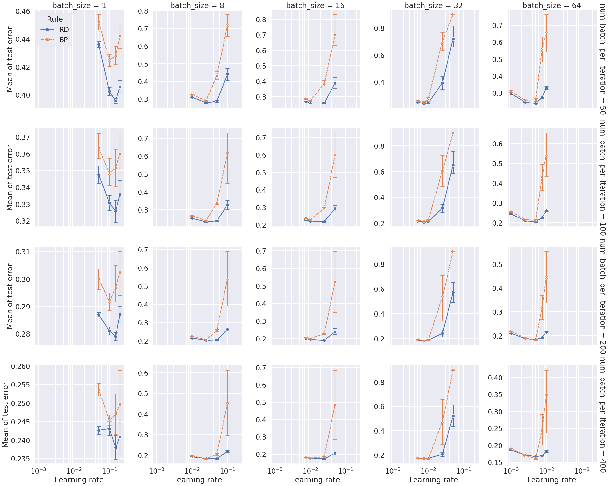
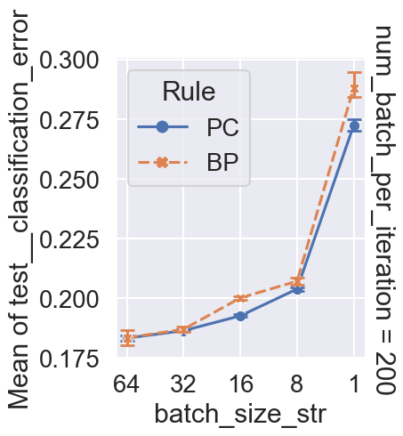
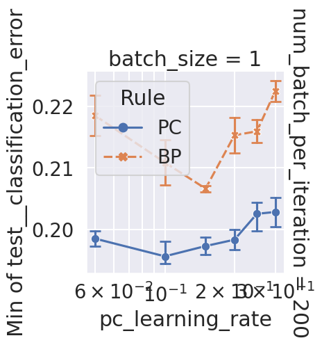
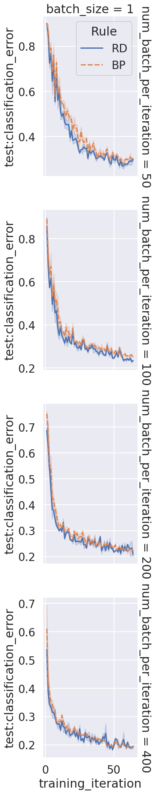
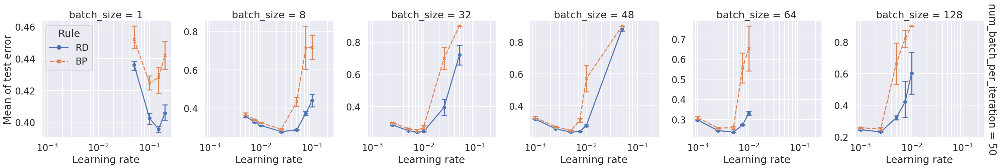
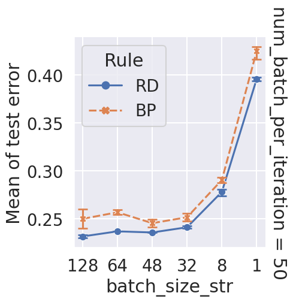

<!-- TOC -->

- [base (nature)](#base-nature)
  - [mean-best (nature)](#mean-best-nature)
  - [min (nature)](#min-nature)

<!-- /TOC -->

# base (nature)

Search over batch_size and num_batch_per_iteration.

```bash
ray job submit --runtime-env runtime_envs/runtime_env_without_ip.yaml --address $PSSR -- python main.py -c nature_none_batch_new_analysis/base-b1
ray job submit --runtime-env runtime_envs/runtime_env_without_ip.yaml --address $PSSR -- python main.py -c nature_none_batch_new_analysis/base-b8
ray job submit --runtime-env runtime_envs/runtime_env_without_ip.yaml --address $PSSR -- python main.py -c nature_none_batch_new_analysis/base-b16
ray job submit --runtime-env runtime_envs/runtime_env_without_ip.yaml --address $PSSR -- python main.py -c nature_none_batch_new_analysis/base-b32
ray job submit --runtime-env runtime_envs/runtime_env_without_ip.yaml --address $PSSR -- python main.py -c nature_none_batch_new_analysis/base-b64
```

<!-- ## mean

This plot is to make sure the laerning rates searched are good.

```bash
python analysis_v1.py \
-t "batch_size-mean" \
-l "../general-energy-nets-results/nature_none_batch_new_analysis/" \
-m "df['test__classification_error'].mean()" \
-f "./experiments/nature_none_batch_new_analysis/base-b1.yaml" "./experiments/nature_none_batch_new_analysis/base-b8.yaml" "./experiments/nature_none_batch_new_analysis/base-b16.yaml" "./experiments/nature_none_batch_new_analysis/base-b32.yaml" "./experiments/nature_none_batch_new_analysis/base-b64.yaml" \
-v \
"import experiments.nature_none_batch_new_analysis.utils as u" \
"u.plot_mean(df)"
```

 -->

## mean-best (nature)

This plot is to make sure the desired effects can be observed.

```bash
python analysis_v1.py \
-t "batch_size-mean-best" \
-l "../general-energy-nets-results/nature_none_batch_new_analysis/" \
-m "df['test__classification_error'].mean()" \
-f "./experiments/nature_none_batch_new_analysis/base-b1.yaml" "./experiments/nature_none_batch_new_analysis/base-b8.yaml" "./experiments/nature_none_batch_new_analysis/base-b16.yaml" "./experiments/nature_none_batch_new_analysis/base-b32.yaml" "./experiments/nature_none_batch_new_analysis/base-b64.yaml" \
-v \
"import experiments.nature_none_batch_new_analysis.utils as u" \
"u.plot_mean_best(df)"
```



## min (nature)

This plot is to make sure the laerning rates searched are good.

```bash
python analysis_v1.py \
-t "batch_size-min" \
-l "../general-energy-nets-results/nature_none_batch_new_analysis/" \
-m "df['test__classification_error'].min()" \
-f "./experiments/nature_none_batch_new_analysis/base-b1.yaml" \
-v \
"import experiments.nature_none_batch_new_analysis.utils as u" \
"u.plot_min(df)"
```



<!-- ## curve

```bash
python analysis_v1.py \
-t "batch_size-curve" \
-l "../general-energy-nets-results/nature_none_batch_new_analysis/" \
-m "compress_plot('test__classification_error','training_iteration')" "df['test__classification_error'].mean()" \
-f "./experiments/nature_none_batch_new_analysis/base-b1.yaml" \
-v \
"import experiments.nature_none_batch_new_analysis.utils as u" \
"u.plot_curve(df)"
```



But this is hard to produce as well. But no need any more as we can use search_depth for this. -->

<!-- # base-50 (deprecated)

Search over batch_size. Fixing num_batch_per_iteration to 50.

```bash
/* master */
CUDA_VISIBLE_DEVICES=0,1 ray job submit --runtime-env runtime_envs/runtime_env_without_ip.yaml --address $PSSR -- python main.py -c nature_none_batch_new_analysis/base-50-b1

/* mater */
CUDA_VISIBLE_DEVICES=3 ray job submit --runtime-env runtime_envs/runtime_env_without_ip.yaml --address $PSSR -- python main.py -c nature_none_batch_new_analysis/base-50-b8

/* master */
CUDA_VISIBLE_DEVICES=3 ray job submit --runtime-env runtime_envs/runtime_env_without_ip.yaml --address $PSSR -- python main.py -c nature_none_batch_new_analysis/base-50-b32

/* master */
CUDA_VISIBLE_DEVICES=1,3 ray job submit --runtime-env runtime_envs/runtime_env_without_ip.yaml --address $PSSR -- python main.py -c nature_none_batch_new_analysis/base-50-b48

/* master */
CUDA_VISIBLE_DEVICES=0,1,2,3 ray job submit --runtime-env runtime_envs/runtime_env_without_ip.yaml --address $PSSR -- python main.py -c nature_none_batch_new_analysis/base-50-b64

/* master */
CUDA_VISIBLE_DEVICES=0,1,2,3 ray job submit --runtime-env runtime_envs/runtime_env_without_ip.yaml --address $PSSR -- python main.py -c nature_none_batch_new_analysis/base-50-b128
```

## mean

```bash
python analysis_v1.py \
-t "batch_size-50-mean" \
-l "../general-energy-nets-results/nature_none_batch_new_analysis/" \
-m "df['test__classification_error'].mean()" \
-f "./experiments/nature_none_batch_new_analysis/base-50-b1.yaml" "./experiments/nature_none_batch_new_analysis/base-50-b8.yaml" "./experiments/nature_none_batch_new_analysis/base-50-b32.yaml" "./experiments/nature_none_batch_new_analysis/base-50-b48.yaml" "./experiments/nature_none_batch_new_analysis/base-50-b64.yaml" "./experiments/nature_none_batch_new_analysis/base-50-b128.yaml" \
-v \
"import experiments.nature_none_batch_new_analysis.utils as u" \
"u.plot_mean(df)"
```



## mean-best

```bash
python analysis_v1.py \
-t "batch_size-50-mean-best" \
-l "../general-energy-nets-results/nature_none_batch_new_analysis/" \
-m "df['test__classification_error'].mean()" \
-f "./experiments/nature_none_batch_new_analysis/base-50-b1.yaml" "./experiments/nature_none_batch_new_analysis/base-50-b8.yaml" "./experiments/nature_none_batch_new_analysis/base-50-b32.yaml" "./experiments/nature_none_batch_new_analysis/base-50-b48.yaml" "./experiments/nature_none_batch_new_analysis/base-50-b64.yaml" "./experiments/nature_none_batch_new_analysis/base-50-b128.yaml" \
-v \
"import experiments.nature_none_batch_new_analysis.utils as u" \
"u.plot_mean_best(df)"
```



## curve-best

```bash
python analysis_v1.py \
-t "batch_size-50-curve-best" \
-l "../general-energy-nets-results/nature_none_batch_new_analysis/" \
-m "compress_plot('test__classification_error','training_iteration')" "df['test__classification_error'].mean()" \
-f "./experiments/nature_none_batch_new_analysis/base-50-b1.yaml" "./experiments/nature_none_batch_new_analysis/base-50-b8.yaml" "./experiments/nature_none_batch_new_analysis/base-50-b32.yaml" "./experiments/nature_none_batch_new_analysis/base-50-b64.yaml" \
-v \
"import experiments.nature_none_batch_new_analysis.utils as u" \
"u.plot_curve_best(df)"
```

 -->
