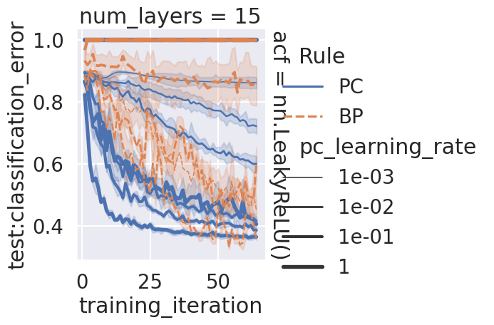

<!-- TOC -->

- [base-focus](#base-focus)
  - [mean](#mean)
  - [mean-select\_lr](#mean-select_lr)
  - [curve-select\_lr](#curve-select_lr)

<!-- /TOC -->

<!-- # base

```bash
python main.py -c nature_search_depth/base
```

## mean

```bash
python analysis_v1.py \
-t "mean" \
-l "$RESULTS_DIR/nature_search_depth/" \
-m "df['test__classification_error'].mean()" \
-f "./experiments/nature_search_depth/base.yaml" \
-g "init_fn" \
-v \
"import experiments.nature_search_depth.utils as u" \
"u.plot_mean(df)"
```

[doc](./mean.md) -->

# base-focus

```bash
ray job submit --runtime-env runtime_envs/runtime_env_without_ip.yaml --address $pssr -- python main.py -c nature_search_depth/base-focus
```

## mean

```bash
python analysis_v1.py \
-t "mean-focus" \
-l "$RESULTS_DIR/nature_search_depth/" \
-m "df['test__classification_error'].mean()" \
-f "./experiments/nature_search_depth/base-focus.yaml" \
-g "init_fn" \
-v \
"import experiments.nature_search_depth.utils as u" \
"u.plot_mean(df)"
```

[doc](./mean-focus.md)


## mean-select_lr

```bash
python analysis_v1.py \
-t "mean-focus-select_lr" \
-l "$RESULTS_DIR/nature_search_depth/" \
-m "df['test__classification_error'].mean()" \
-f "./experiments/nature_search_depth/base-focus.yaml" \
-g "init_fn" \
-v \
"import experiments.nature_search_depth.utils as u" \
"u.plot_mean_select_lr(df, config_columns)"
```

[doc](./mean-focus-select_lr.md)


<!-- ## curve-deep

```bash
python analysis_v1.py \
-t "curve-focus-curve-deep" \
-l "$RESULTS_DIR/nature_search_depth/" \
-m "compress_plot('test__classification_error','training_iteration')" "df['test__classification_error'].mean()" \
-f "./experiments/nature_search_depth/base-focus-curve-deep.yaml" \
-v \
"import experiments.nature_search_depth.utils as u" \
"u.plot_curve(df, config_columns, is_select_lr=False)"
```

 -->

## curve-select_lr

```bash
python analysis_v1.py \
-t "curve-focus-select_lr" \
-l "$RESULTS_DIR/nature_search_depth/" \
-m "compress_plot('test__classification_error','training_iteration')" "df['test__classification_error'].mean()" \
-f "./experiments/nature_search_depth/base-focus.yaml" \
-g "init_fn" \
-v \
"import experiments.nature_search_depth.utils as u" \
"u.plot_curve(df, config_columns)"
```

[doc](./curve-focus-select_lr.md)


<!-- # base-regression

```bash
/* master */
CUDA_VISIBLE_DEVICES=1,2,3 python main.py -c nature_search_depth/base-regression-pc -m T1

/* master */
CUDA_VISIBLE_DEVICES=0 python main.py -c nature_search_depth/base-regression-bp -m T1
```

## mean

```bash
python analysis_v1.py \
-t "mean-regression" \
-l "$RESULTS_DIR/nature_search_depth/" \
-m "df['train:error'].mean()" \
-f "./experiments/nature_search_depth/base-regression-pc.yaml" "./experiments/nature_search_depth/base-regression-bp.yaml" \
-g "init_fn" \
-v \
"import experiments.nature_search_depth.utils as u" \
"u.plot_mean(df,'train')"
```

[doc](./mean-regression.md)

## mean-select_lr

```bash
python analysis_v1.py \
-t "mean-regression-select_lr" \
-l "$RESULTS_DIR/nature_search_depth/" \
-m "df['train:error'].mean()" \
-f "./experiments/nature_search_depth/base-regression-pc.yaml" "./experiments/nature_search_depth/base-regression-bp.yaml" \
-g "init_fn" \
-v \
"import experiments.nature_search_depth.utils as u" \
"u.plot_mean_select_lr(df,'train')"
```

[doc](./mean-regression-select_lr.md)

## curve

```bash
python analysis_v1.py \
-t "curve-regression" \
-l "$RESULTS_DIR/nature_search_depth/" \
-m "compress_plot('train:error','training_iteration')" \
-f "./experiments/nature_search_depth/base-regression-pc.yaml" "./experiments/nature_search_depth/base-regression-bp.yaml" \
-g "init_fn" \
-v \
"import experiments.nature_search_depth.utils as u" \
"u.regression_plot_curve(df,'train')"
```

[doc](./curve-regression.md) -->
