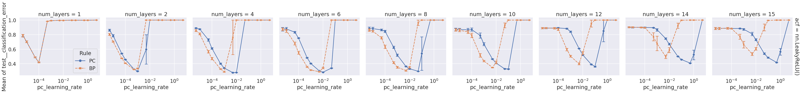
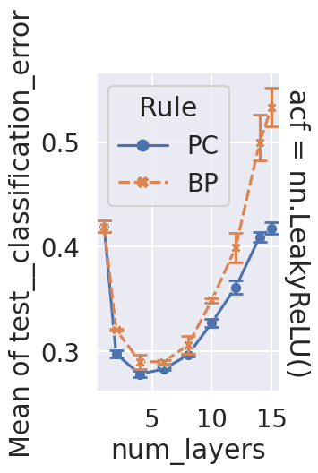
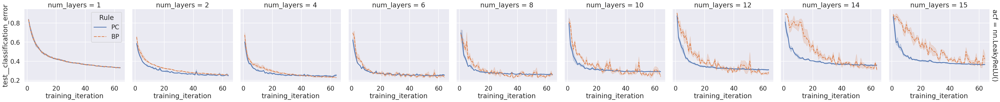

# base-focus

```bash
python main.py -c nature_search_depth/base-focus
```

## mean

```bash
python analysis_v1.py \
-t "mean-focus" \
-l "$RESULTS_DIR/nature_search_depth/" \
-m "df['test__classification_error'].mean()" \
-f "./experiments/nature_search_depth/base-focus.yaml" \
-g "init_fn" \
--fig-name fig3-g \
--source-exclude-columns 'data_packs: test: data_loader' 'data_packs: test: do' Dataset gain_lg init_fn 'log_packs: classification_error: at_data_pack' 'log_packs: classification_error: log' partial_num acf batch_size hidden_size num_iterations \
-v \
"import experiments.nature_search_depth.utils as u" \
"u.plot_mean(df)"
```



## mean-select_lr

```bash
python analysis_v1.py \
-t "mean-focus-select_lr" \
-l "$RESULTS_DIR/nature_search_depth/" \
-m "df['test__classification_error'].mean()" \
-f "./experiments/nature_search_depth/base-focus.yaml" \
-g "init_fn" \
-v \
"import experiments.nature_search_depth.utils as u" \
"u.plot_mean_select_lr(df, config_columns)"
```

[doc](./mean-focus-select_lr.md)



## curve-select_lr

```bash
python analysis_v1.py \
-t "curve-focus-select_lr" \
-l "$RESULTS_DIR/nature_search_depth/" \
-m "compress_plot('test__classification_error','training_iteration')" "df['test__classification_error'].mean()" \
-f "./experiments/nature_search_depth/base-focus.yaml" \
-g "init_fn" \
-v \
"import experiments.nature_search_depth.utils as u" \
"u.plot_curve(df, config_columns)"
```

[doc](./curve-focus-select_lr.md)


