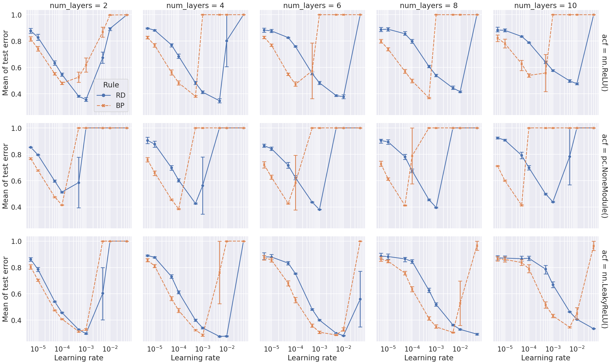
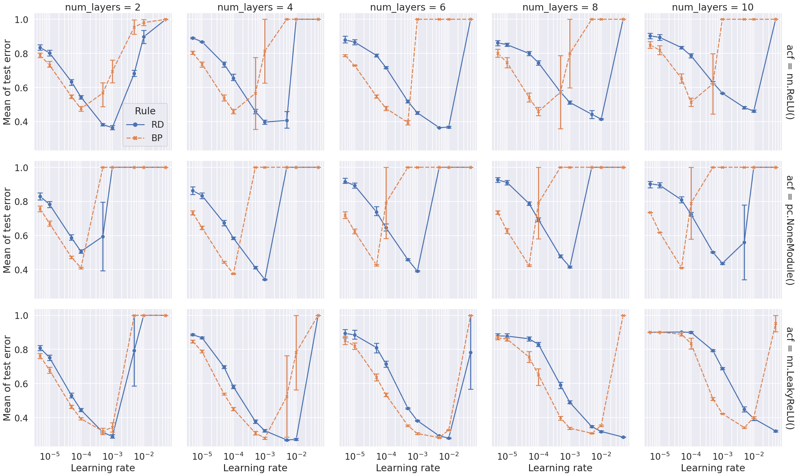

# Figures

| 'init_fn': 'torch.nn.init.xavier_normal_'   | 'init_fn': 'torch.nn.init.xavier_uniform_'   |
|:--------------------------------------------|:---------------------------------------------|
|  |  |
