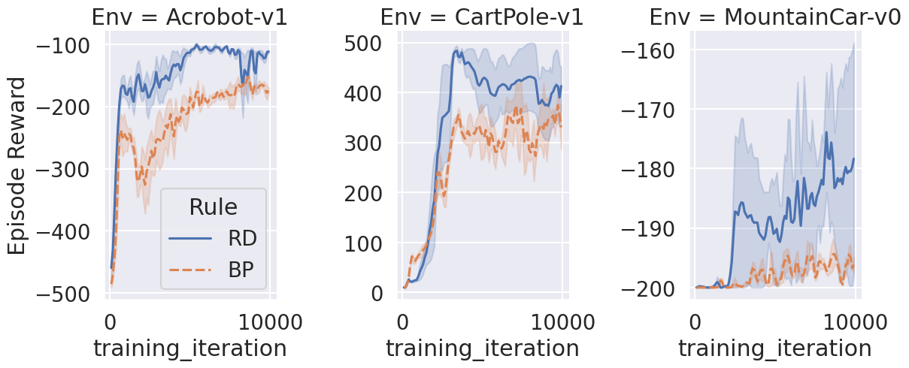

# base-focus

```bash
python main.py -c nature_simple_dqn_new/base-focus
```

## curve (nature)

```bash
python analysis_v1.py \
-t "base-focus-curve" \
-l "$RESULTS_DIR/nature_simple_dqn_new/" \
-m "compress_plot('Episode Reward','training_iteration')" "df['Episode Reward'].mean()" \
-f "./experiments/nature_simple_dqn_new/base-focus.yaml" \
-g "Optimizer for inference" "Optimizer for learn" "is_q_target" "bias" "Inference rate" "is_norm_obs" "is_norm_rew" "batch_size" "buffer_limit" "gamma" "num_learn_epochs_per_eposide" "interval_update_target_q" "is_detach_target" "MainT" "pc_layer_at" "acf" \
-v \
"import experiments.nature_simple_dqn_new.utils as u" \
"u.plot(df)"
```

[doc](./base-focus-curve.md)


