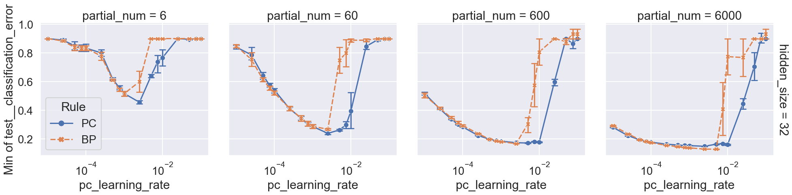
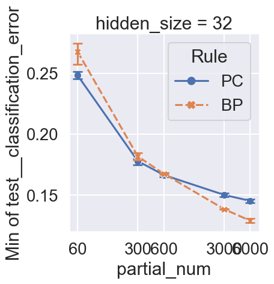
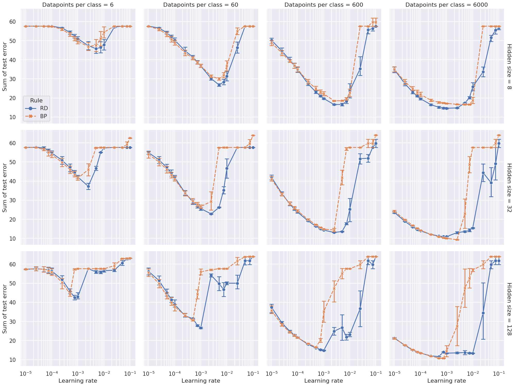

<!-- TOC -->

-   [Comparing BP and IL (Nature Results)](#comparing-bp-and-il-nature-results)
    -   [min error](#min-error)

<!-- /TOC -->

```bash
1a8fcae9306fdc7c70f87d7233aa4678abc66481
```

# Comparing BP and IL (Nature Results)

```bash
ray job submit --runtime-env runtime_envs/runtime_env_without_ip.yaml --address $pssr -- python main.py -c nature_small-arch-small-data/bp-il
```

## min error

```bash
python analysis_v1.py \
-t "bp-il-min" \
-l "$RESULTS_DIR/nature_small-arch-small-data/" \
-m "df['test__classification_error'].min()" \
-f "./experiments/nature_small-arch-small-data/bp-il.yaml" \
-v \
"df=nature_pre(df)" \
"g=nature_relplot(data=df,x='pc_learning_rate',y='Min of test__classification_error',hue='Rule',style='Rule',col='partial_num',row='hidden_size').set(xscale='log')" \
"nature_post(g,is_grid=True)"
```



```bash
python analysis_v1.py \
-t "bp-il-min-reduce" \
-l "$RESULTS_DIR/nature_small-arch-small-data/" \
-m "df['test__classification_error'].min()" \
-f "./experiments/nature_small-arch-small-data/bp-il.yaml" \
--fig-name fig4-h \
--source-include-columns Rule seed partial_num "Min of test__classification_error" \
-v \
"df=nature_pre(df)" \
"groups=['Rule','hidden_size','partial_num','pc_learning_rate']" \
"df=add_metric_per_group(df,groups,lambda df: ('Mean Per Group', df['Min of test__classification_error'].mean()))" \
"groups.pop(-1)" \
"df=select_rows_per_group(df,groups,lambda df: df['Mean Per Group']==df['Mean Per Group'].min())" \
"df=df.sort_values(['Rule'], ascending=False)" \
"g=nature_relplot(data=df,x='partial_num',y='Min of test__classification_error',hue='Rule',style='Rule',col='hidden_size').set(xscale='log')" \
"nature_post(g,xticks=[60,300,600,3000,6000],is_grid=False)"

# "df=df.sort_values(['partial_num'], ascending=True)" \
# "df=au.new_col(df,'partial_num_text',lambda row: str(row['partial_num']))" \
# "g=au.nature_relplot(data=df,x='partial_num_text',y='Min of test__classification_error',hue='Rule',style='Rule',col='hidden_size')" \
# "nature_post(g,xticks=['60','300','600','3000','6000'],is_grid=False)"
```



<!-- ## sample efficiency

```bash
python analysis_v1.py \
-t "bp-il-sum" \
-l "$RESULTS_DIR/nature_small-arch-small-data/" \
-m "df['test__classification_error'].sum()" \
-f "./experiments/nature_small-arch-small-data/bp-il.yaml" \
-d \
-v \
"df=nature_pre(df)" \
"g=nature_relplot(data=df,x='pc_learning_rate',y='Sum of test__classification_error',hue='Rule',style='Rule',col='partial_num',row='hidden_size').set(xscale='log')" \
"nature_post(g,is_grid=True)"
```



```bash
python analysis_v1.py \
-t "bp-il-sum-reduce" \
-l "$RESULTS_DIR/nature_small-arch-small-data/" \
-m "df['test__classification_error'].sum()" \
-f "./experiments/nature_small-arch-small-data/bp-il.yaml" \
-v \
"df=nature_pre(df)" \
"groups=['Rule','hidden_size','partial_num','pc_learning_rate']" \
"df=add_metric_per_group(df,groups,lambda df: ('Sum per group', df['Sum of test__classification_error'].sum()))" \
"groups.pop(-1)" \
"df=select_rows_per_group(df,groups,lambda df: df['Sum per group']==df['Sum per group'].min())" \
"df=df.sort_values(['Rule'], ascending=False)" \
"g=nature_relplot(data=df,x='partial_num',y='Sum of test__classification_error',hue='Rule',style='Rule',col='hidden_size').set(xscale='log')" \
"nature_post(g,xticks=[6,60,600,6000],is_grid=False)"
```

 -->

<!-- # Comparing BP and IL, test loss co

```bash
ray job submit --runtime-env runtime_envs/runtime_env_without_ip.yaml --address $pssr -- python main.py -c nature_small-arch-small-data/bp-il-test-loss-co.yaml
sbatch -J ./experiments/nature_small-arch-small-data/bp-il-test-loss-co.yaml ./submit.sh
```

## min error

```bash
python analysis_v1.py \
-t "bp-il-test-loss-co-min" \
-l ../general-energy-nets-results/nature_small-arch-small-data/ \
-m "df['test__classification_error'].min()" \
-f "./experiments/nature_small-arch-small-data/bp-il-test-loss-co.yaml" \
-v \
"df=nature_pre(df)" \
"g=nature_relplot(data=df,x='pc_learning_rate',y='Min of test__classification_error',hue='PC',col='loss_fn_coefficient')" \
"nature_post(g)"
```


CONCLUSION:
- loss_fn_coefficient makes no difference

# Comparing BP and IL, test inference rate and T

```bash
CUDA_VISIBLE_DEVICES=0,1,2,4,5,6,7 ray job submit --runtime-env runtime_envs/runtime_env_without_ip.yaml --address $pssr -- python main.py -c nature_small-arch-small-data/bp-il-test-inference-rate-T.yaml
sbatch -J ./experiments/nature_small-arch-small-data/bp-il-test-inference-rate-T.yaml ./submit.sh
```

## min error

```bash
python analysis_v1.py \
-t "bp-il-test-inference-rate-T-min" \
-l ../general-energy-nets-results/nature_small-arch-small-data/ \
-m "df['test__classification_error'].min()" \
-f "./experiments/nature_small-arch-small-data/bp-il-test-inference-rate-T.yaml" \
-v \
"df=nature_pre(df)" \
"g=nature_relplot(data=df,x='pc_learning_rate',y='Min of test__classification_error',hue='PC',col='inference rate',row='T')" \
"nature_post(g)"
```


CONCLUSION:
- inference rate and T do NOT improve anything

# Comparing RBP and Sa-Z-IL (x_lr_discount=0.5)

```bash
ray job submit --runtime-env runtime_envs/runtime_env_without_ip.yaml --address $pssr -- python main.py -c nature_small-arch-small-data/rbp-sazil.yaml
```

## sample efficiency

```bash
python analysis_v1.py \
-t "rbp-sazil" \
-l ../general-energy-nets-results/nature_small-arch-small-data/ \
-m "df['test__classification_error'].mean()" \
-f ./experiments/nature_small-arch-small-data/rbp-sazil.yaml \
-v \
"df=nature_pre(df)" \
"g=nature_relplot(data=df,x='p_lr',y='mean_test__classification_error',hue='PC',col='partial_num',row='ns').set(yscale='log')" \
"nature_post(g)"
```


## final error

```bash
python analysis_v1.py \
-t "rbp-sazil-final" \
-l ../general-energy-nets-results/nature_small-arch-small-data/ \
-m "df['test__classification_error'].iloc[-1]" \
-f ./experiments/nature_small-arch-small-data/rbp-sazil.yaml \
-v \
"df=nature_pre(df)" \
"g=nature_relplot(data=df,x='p_lr',y='last_test__classification_error',hue='PC',col='partial_num',row='ns')" \
"nature_post(g)"
```


# Comparing RBP and Sa-Z-IL (x_lr_discount=1.0)

```bash
ray job submit --runtime-env runtime_envs/runtime_env_without_ip.yaml --address $pssr -- python main.py -c nature_small-arch-small-data/rbp-sazil-nd.yaml
```

## sample efficiency

```bash
python analysis_v1.py \
-t "rbp-sazil-nd" \
-l ../general-energy-nets-results/nature_small-arch-small-data/ \
-m "df['test__classification_error'].mean()" \
-f ./experiments/nature_small-arch-small-data/rbp-sazil-nd.yaml \
-v \
"df=nature_pre(df)" \
"g=nature_relplot(data=df,x='p_lr',y='mean_test__classification_error',hue='PC',col='partial_num',row='ns').set(yscale='log')" \
"nature_post(g)"
```


## final error

```bash
python analysis_v1.py \
-t "rbp-sazil-nd-final" \
-l ../general-energy-nets-results/nature_small-arch-small-data/ \
-m "df['test__classification_error'].iloc[-1]" \
-f ./experiments/nature_small-arch-small-data/rbp-sazil-nd.yaml \
-v \
"df=nature_pre(df)" \
"g=nature_relplot(data=df,x='p_lr',y='last_test__classification_error',hue='PC',col='partial_num',row='ns')" \
"nature_post(g)"
```


# Comparing RBP and Sa-Z-IL (what is wrong)

(tune sazil)

```bash
ray job submit --runtime-env runtime_envs/runtime_env_without_ip.yaml --address $pssr -- python main.py -c nature_small-arch-small-data/rbp-sazil-wiw.yaml
```

## sample efficiency

```bash
python analysis_v1.py \
-t "rbp-sazil-wiw" \
-l ../general-energy-nets-results/nature_small-arch-small-data/ \
-m "df['test__classification_error'].mean()" \
-f ./experiments/nature_small-arch-small-data/rbp-sazil-wiw.yaml \
-v \
"df=nature_pre(df)" \
"g=nature_relplot(data=df,x='p_lr',y='mean_test__classification_error',hue='PC',col='x_lr_discount').set(yscale='log')" \
"nature_post(g)"
```

```bash
"df=df.sort_values(['bias','batch_size','x_lr','x_lr_discount','T','gain'])" \
"df=combine_cols(df,'col',['bias','batch_size','x_lr'])" \
"df=combine_cols(df,'row',['x_lr_discount','T','gain'])" \
```


## final error

```bash
python analysis_v1.py \
-t "rbp-sazil-wiw-final" \
-l ../general-energy-nets-results/nature_small-arch-small-data/ \
-m "df['test__classification_error'].iloc[-1]" \
-f ./experiments/nature_small-arch-small-data/rbp-sazil-wiw.yaml \
-v \
"df=nature_pre(df)" \
"g=nature_relplot(data=df,x='p_lr',y='last_test__classification_error',hue='PC',col='x_lr_discount').set(yscale='log')" \
"nature_post(g)"
```


- This is weird, I cannot reproduce experiments of sazil and rbp here. Maybe searching gain is necessary for comparing sazil and rbp? Anyway, I am focusing on IL and BP now, so leave it here.
- Note that the experiments of sazil and rbp are still reproduceable by the other experiments folder and commit point. -->
