- [target alignment for deeper nets](#target-alignment-for-deeper-nets)
  - [base-depth (nature)](#base-depth-nature)
  - [base-depth-acf (nature)](#base-depth-acf-nature)
  - [base-depth-init (nature)](#base-depth-init-nature)
  - [base-depth-orth-init (nature)](#base-depth-orth-init-nature)

<!-- # base

```bash

ray job submit --runtime-env runtime_envs/runtime_env_without_ip.yaml --address $pssr --  python main.py -c nature_target_alignment/base
```

## plot

```bash
python analysis_v1.py \
-t "plot" \
-l "$RESULTS_DIR/nature_target_alignment/" \
-m "df['train__target_alignment'].iloc[-1]" \
-f "./experiments/nature_target_alignment/base.yaml" \
-v \
"import experiments.nature_target_alignment.utils as u" \
"u.plot(df)"
```

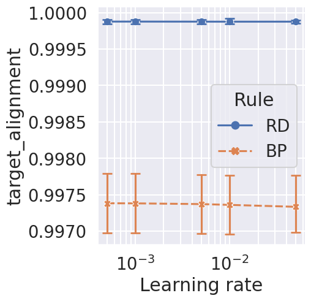

# base-iteration

```bash

ray job submit --runtime-env runtime_envs/runtime_env_without_ip.yaml --address $pssr --  python main.py -c nature_target_alignment/base-iteration
```

## plot

```bash
python analysis_v1.py \
-t "plot-iteration" \
-l "$RESULTS_DIR/nature_target_alignment/" \
-m "compress_plot('train__target_alignment','training_iteration')" \
-f "./experiments/nature_target_alignment/base-iteration.yaml" \
-v \
"import experiments.nature_target_alignment.utils as u" \
"u.plot_iteration(df)"
```

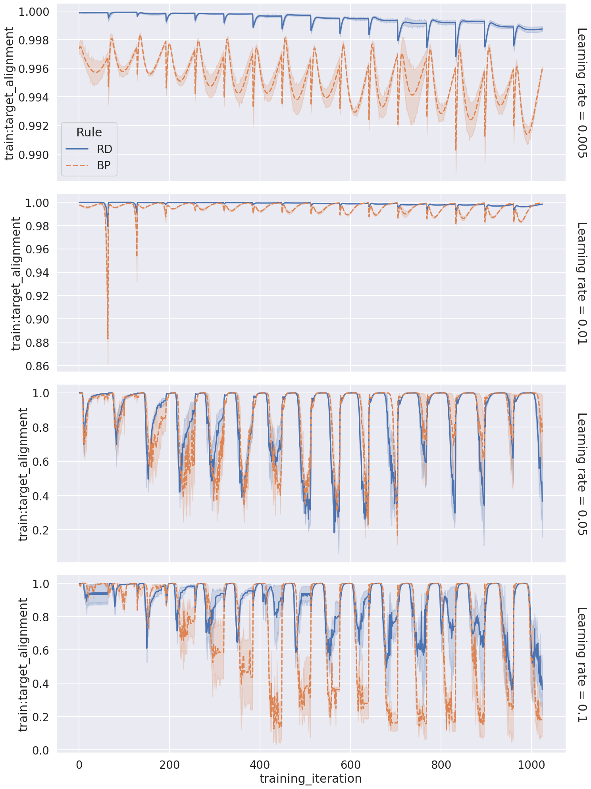

## plot-loss

```bash
python analysis_v1.py \
-t "plot-loss-iteration" \
-l "$RESULTS_DIR/nature_target_alignment/" \
-m "compress_plot('train:loss','training_iteration')" \
-f "./experiments/nature_target_alignment/base-iteration.yaml" \
-v \
"import experiments.nature_target_alignment.utils as u" \
"u.plot_iteration(df,'loss')"
```

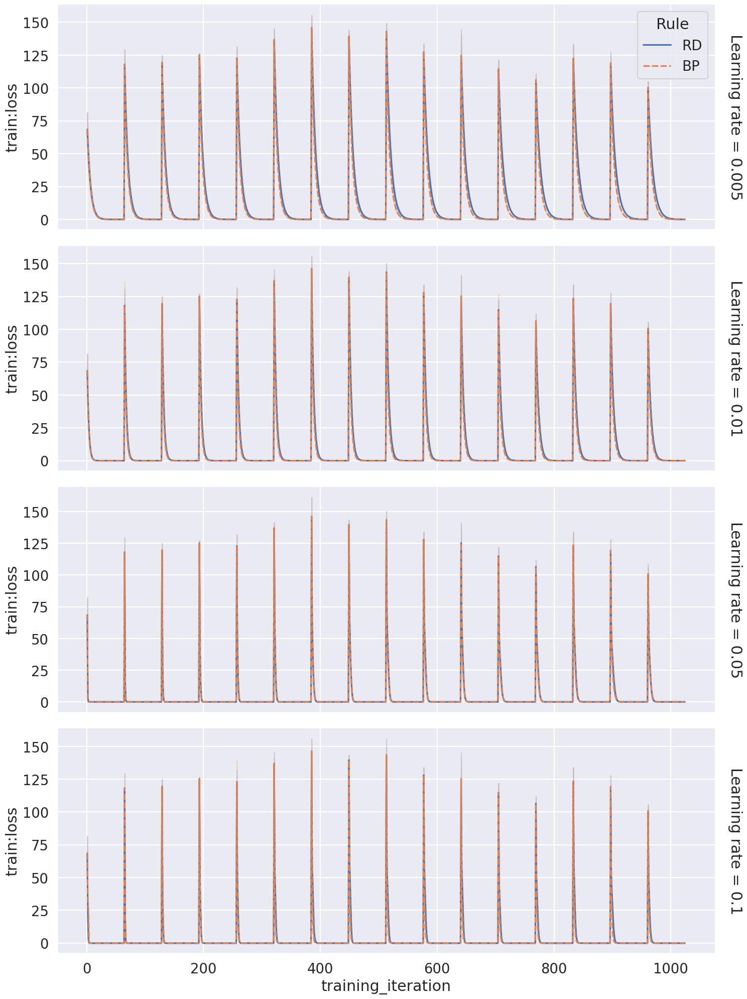

# base-acf

```bash

ray job submit --runtime-env runtime_envs/runtime_env_without_ip.yaml --address $pssr --  python main.py -c nature_target_alignment/base-acf-Sigmoid
ray job submit --runtime-env runtime_envs/runtime_env_without_ip.yaml --address $pssr --  python main.py -c nature_target_alignment/base-acf-Tanh
ray job submit --runtime-env runtime_envs/runtime_env_without_ip.yaml --address $pssr --  python main.py -c nature_target_alignment/base-acf-ReLU
ray job submit --runtime-env runtime_envs/runtime_env_without_ip.yaml --address $pssr --  python main.py -c nature_target_alignment/base-acf-None
```

## plot

```bash
python analysis_v1.py \
-t "plot-acf" \
-l "$RESULTS_DIR/nature_target_alignment/" \
-m "df['train:prediction_std'].iloc[-1]" \
-f "./experiments/nature_target_alignment/base-acf-Sigmoid.yaml" "./experiments/nature_target_alignment/base-acf-Tanh.yaml" "./experiments/nature_target_alignment/base-acf-ReLU.yaml" "./experiments/nature_target_alignment/base-acf-None.yaml" \
-v \
"import experiments.nature_target_alignment.utils as u" \
"u.plot_acf(df)"
```

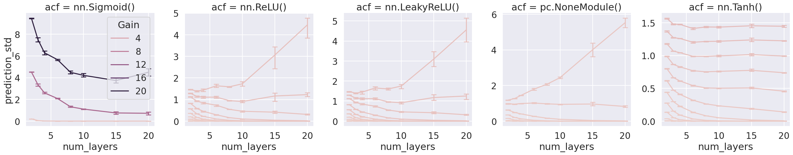 -->

<!-- # base-depth-width

```bash
python main.py -c nature_target_alignment/base-depth-width
``` -->

<!-- ## plot

```bash
python analysis_v1.py \
-t "plot-depth-width" \
-l "$RESULTS_DIR/nature_target_alignment/" \
-m "df['train__target_alignment'].iloc[-1]" \
-f "./experiments/nature_target_alignment/base-depth-width.yaml" \
-v \
"import experiments.nature_target_alignment.utils as u" \
"u.plot_depth_width(df)"
```

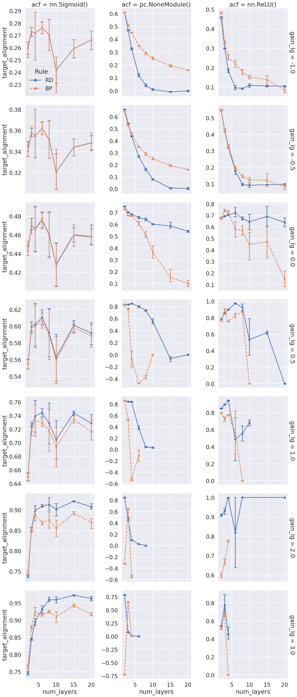 -->

## base-depth-width-linear (nature)

```bash
python main.py -c nature_target_alignment/base-depth-width-linear
```

### plot (nature)

```bash
python analysis_v1.py \
-t "plot-depth-width-linear" \
-l "$RESULTS_DIR/nature_target_alignment/" \
-m "df['train__target_alignment'].iloc[-1]" \
-f "./experiments/nature_target_alignment/base-depth-width-linear.yaml" \
-g "batch_size" \
-v \
"import experiments.nature_target_alignment.utils as u" \
"u.plot_depth_width_linear(df)"
```

[doc](./plot-depth-width-linear.md)

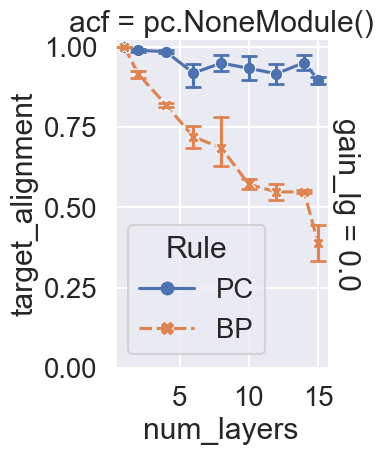

## base-depth-width-linear-angle (nature)

```bash
python main.py -c nature_target_alignment/base-depth-width-linear-angle
```

### plot (nature)

```bash
python analysis_v1.py \
-t "plot-depth-width-linear-angle" \
-l "$RESULTS_DIR/nature_target_alignment/" \
-m "df['train__target_alignment_angle'].iloc[-1]" \
-f "./experiments/nature_target_alignment/base-depth-width-linear-angle.yaml" \
-v \
"import experiments.nature_target_alignment.utils as u" \
"u.plot_depth_width_linear_angle(df)"
```

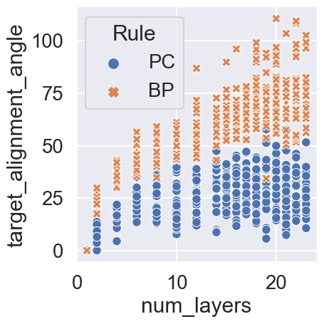

```bash
python analysis_v1.py \
-t "plot-depth-width-linear-angle_alignment" \
-l "$RESULTS_DIR/nature_target_alignment/" \
-m "df['train__target_alignment'].iloc[-1]" \
-f "./experiments/nature_target_alignment/base-depth-width-linear-angle.yaml" \
-v \
"import experiments.nature_target_alignment.utils as u" \
"u.plot_depth_width_linear_angle_alignment(df)"
```

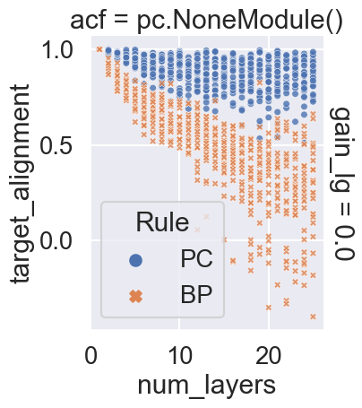

<!-- ## base-width-linear

```bash

ray job submit --runtime-env runtime_envs/runtime_env_without_ip.yaml --address $pssr --  python main.py -c nature_target_alignment/base-width-linear
```

### plot

```bash

python analysis_v1.py \
-t "plot-width-linear" \
-l "$RESULTS_DIR/nature_target_alignment/" \
-m "df['train__target_alignment'].iloc[-1]" \
-f "./experiments/nature_target_alignment/base-width-linear.yaml" \
-g "batch_size" \
-v \
"import experiments.nature_target_alignment.utils as u" \
"u.plot_width_linear(df)"
```

[doc](./plot-width-linear.md)

This still does not provide insights on why PC performs better with smaller hidden sizes.

## plot-prediction_std

```bash
python analysis_v1.py \
-t "plot-prediction_std-depth-width" \
-l "$RESULTS_DIR/nature_target_alignment/" \
-m "df['train:prediction_std'].iloc[-1]" \
-f "./experiments/nature_target_alignment/base-depth-width.yaml" \
-v \
"import experiments.nature_target_alignment.utils as u" \
"u.plot_depth_width(df,'prediction_std')"
```

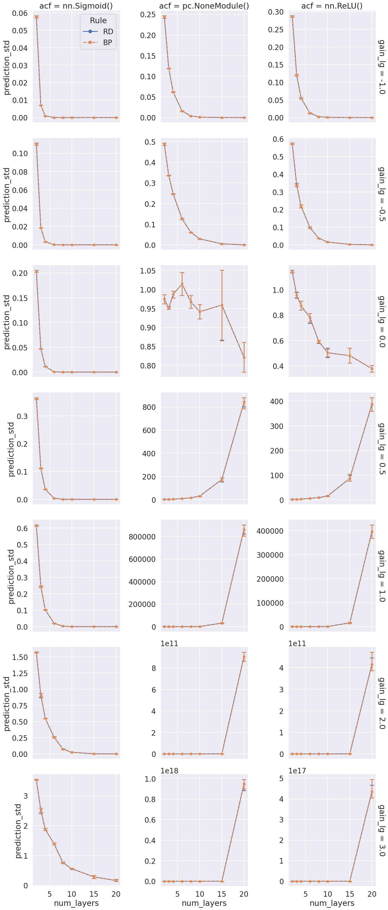

# base-acf-init

```bash

ray job submit --runtime-env runtime_envs/runtime_env_without_ip.yaml --address $pssr --  python main.py -c nature_target_alignment/base-acf-init
```

## plot-acf-init

```bash
python analysis_v1.py \
-t "plot-acf-init" \
-l "$RESULTS_DIR/nature_target_alignment/" \
-m "df['train__target_alignment'].iloc[-1]" \
-f "./experiments/nature_target_alignment/base-acf-init.yaml" \
-v \
"import experiments.nature_target_alignment.utils as u" \
"u.plot_acf_init(df)"
```

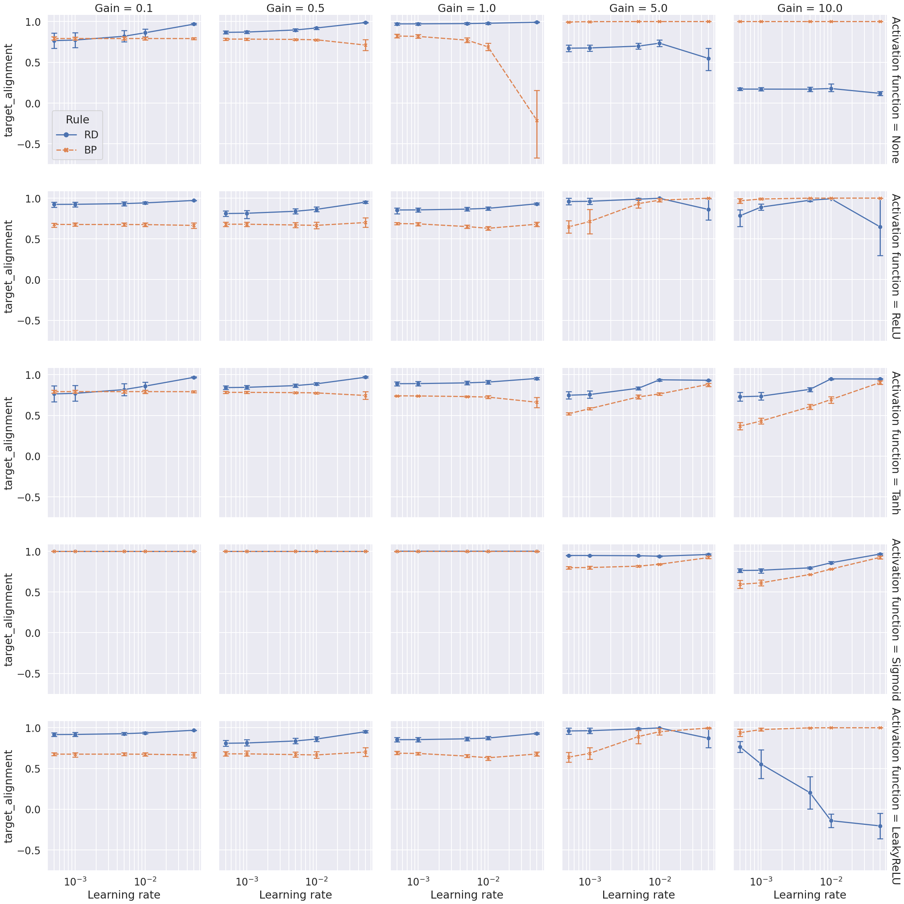

# base-112

Simulating the problem in figure 1 about interference.

```bash

ray job submit --runtime-env runtime_envs/runtime_env_without_ip.yaml --address $pssr --  python main.py -c nature_target_alignment/base-112
```

## plot-112

```bash
python analysis_v1.py \
-t "plot-112" \
-l "$RESULTS_DIR/nature_target_alignment/" \
-m "compress_plot('prediction','training_iteration')" \
-f "./experiments/nature_target_alignment/base-112.yaml" \
-v \
"import experiments.nature_target_alignment.utils as u" \
"u.plot_112(df)"
```

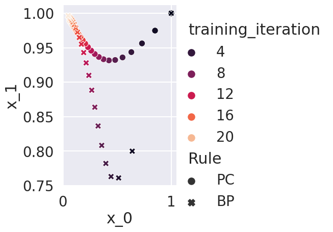

# base-112-lr

Simulating the problem in figure 1 about interference, with search on learning rate.

```bash
# done
ray job submit --runtime-env runtime_envs/runtime_env_without_ip.yaml --address $pssr --  python main.py -c nature_target_alignment/base-112-lr
```

```bash
# done
python analysis_v1.py \
-t "plot-112-lr" \
-l "$RESULTS_DIR/nature_target_alignment/" \
-m "compress_plot('prediction','training_iteration')" \
-f "./experiments/nature_target_alignment/base-112-lr.yaml" \
-v \
"import experiments.nature_target_alignment.utils as u" \
"u.plot_112_lr(df)"
```

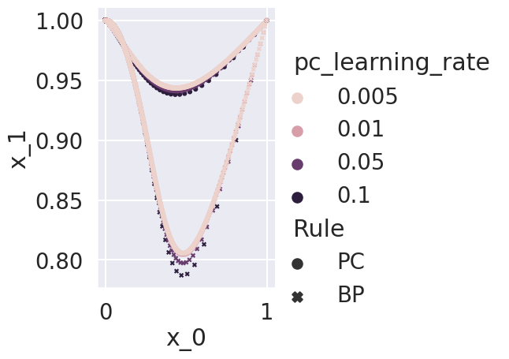

<!-- # base-112-lr-first

Simulating the problem in figure 1 about interference, with search on learning rate, only the first iteration.

```bash
# done
ray job submit --runtime-env runtime_envs/runtime_env_without_ip.yaml --address $pssr --  python main.py -c nature_target_alignment/base-112-lr-first-bp
# done
ray job submit --runtime-env runtime_envs/runtime_env_without_ip.yaml --address $pssr --  python main.py -c nature_target_alignment/base-112-lr-first-pc
```

```bash
# done
python analysis_v1.py \
-t "plot-112-lr-first" \
-l "$RESULTS_DIR/nature_target_alignment/" \
-m "compress_plot('prediction','training_iteration')" \
-f "./experiments/nature_target_alignment/base-112-lr-first-bp.yaml" "./experiments/nature_target_alignment/base-112-lr-first-pc.yaml" \
-v \
"import experiments.nature_target_alignment.utils as u" \
"u.plot_112_lr_first(df)"
```

 -->

<!-- # base-112-heatmap-traj

Simulating the problem in figure 1 about interference, for a traj in hearmap

```bash
# done
ray job submit --runtime-env runtime_envs/runtime_env_without_ip.yaml --address $pssr --  python main.py -c nature_target_alignment/base-112-heatmap-traj
```

```bash
# done
python analysis_v1.py \
-t "plot-112-heatmap-traj" \
-l "$RESULTS_DIR/nature_target_alignment/" \
-m "compress_plot('prediction','training_iteration')" \
-f "./experiments/nature_target_alignment/base-112-heatmap-traj.yaml" \
-v \
"import experiments.nature_target_alignment.utils as u" \
"u.plot_112_heatmap_traj(df)"
```

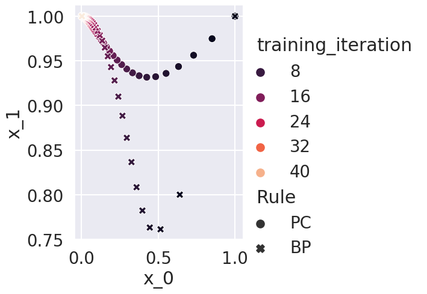

# base-112-heatmap

Simulating the problem in figure 1 about interference, for a heatmap

```bash
# done
ray job submit --runtime-env runtime_envs/runtime_env_without_ip.yaml --address $pssr --  python main.py -c nature_target_alignment/base-112-heatmap
```

```bash
# done
python analysis_v1.py \
-t "plot-112-heatmap" \
-l "$RESULTS_DIR/nature_target_alignment/" \
-m "df['loss'].iloc[-1]" \
-f "./experiments/nature_target_alignment/base-112-heatmap.yaml" \
-v \
"import experiments.nature_target_alignment.utils as u" \
"u.plot_112_heatmap(df)"
```

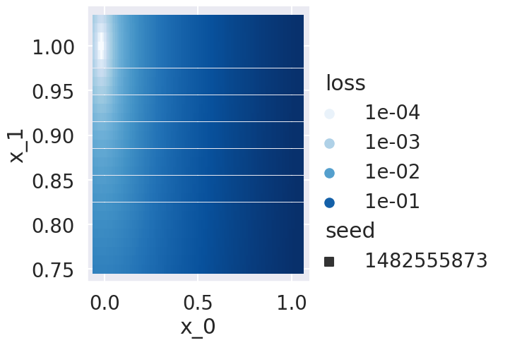 -->

for levelmap, refers to experiment nature_target_alignment_levelmap

# target alignment for deeper nets

## base-depth (nature)

Target alignment of bp, pc and tp (target propropagation)

```bash
ray job submit --runtime-env runtime_envs/runtime_env_without_ip.yaml --address $pssr --  python main.py -c nature_target_alignment/base-depth
ray job submit --runtime-env runtime_envs/runtime_env_without_ip.yaml --address $pssr --  python main.py -c nature_target_alignment/base-depth-tp
```

```bash
python analysis_v1.py \
-t "base-depth" \
-l "$RESULTS_DIR/nature_target_alignment/" \
-m "df['train__target_alignment'].iloc[-1]" \
-f "./experiments/nature_target_alignment/base-depth.yaml" "./experiments/nature_target_alignment/base-depth-tp.yaml" \
-v \
"import experiments.nature_target_alignment.utils as u" \
"u.base_depth(df)"
```

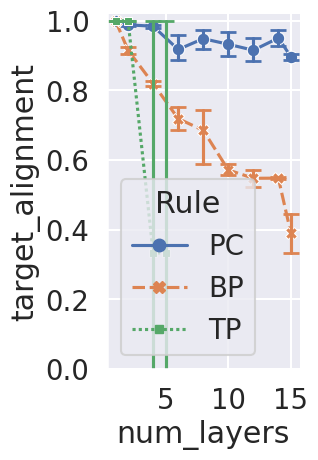

## base-depth-acf (nature)

```bash
ray job submit --runtime-env runtime_envs/runtime_env_without_ip.yaml --address $pssr --  python main.py -c nature_target_alignment/base-depth-acf
```

```bash
python analysis_v1.py \
-t "base-depth-acf" \
-l "$RESULTS_DIR/nature_target_alignment/" \
-m "df['train__target_alignment'].iloc[-1]" \
-f "./experiments/nature_target_alignment/base-depth-acf.yaml" \
-v \
"import experiments.nature_target_alignment.utils as u" \
"u.base_depth_acf(df)"
```

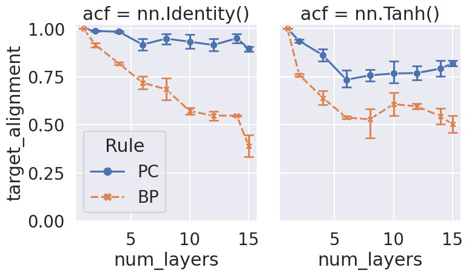

Notes:
- sigmoid give high nature_target_alignment for both bp and pc, due to that it igonres input, so formally run tanh and identity to presenting in the paper
- what is the role of batch_size?

## base-depth-init (nature)

As suggested by the reviewer, use orthogonal init as in Exact solutions to the nonlinear dynamics of learning in deep linear neural networks - Saxe, A. et al. (2013).

```bash
ray job submit --runtime-env runtime_envs/runtime_env_without_ip.yaml --address $pssr --  python main.py -c nature_target_alignment/base-depth-init
```

```bash
python analysis_v1.py \
-t "base-depth-init" \
-l "$RESULTS_DIR/nature_target_alignment/" \
-m "df['train__target_alignment'].iloc[-1]" \
-f "./experiments/nature_target_alignment/base-depth-init.yaml" \
-v \
"import experiments.nature_target_alignment.utils as u" \
"u.base_depth_init(df)"
```

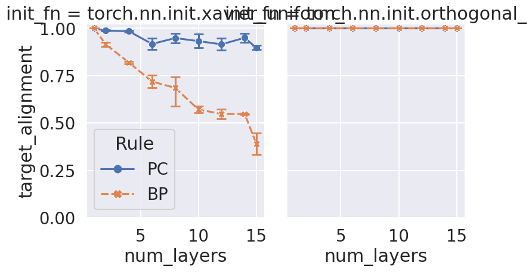

## base-depth-orth-init (nature)

Look at if orth init have difference with different learning rates.

```bash
ray job submit --runtime-env runtime_envs/runtime_env_without_ip.yaml --address $pssr --  python main.py -c nature_target_alignment/base-depth-orth-init
```

```bash
python analysis_v1.py \
-t "base-depth-orth-init" \
-l "$RESULTS_DIR/nature_target_alignment/" \
-m "df['train__target_alignment'].iloc[-1]" \
-f "./experiments/nature_target_alignment/base-depth-orth-init.yaml" \
-v \
"import experiments.nature_target_alignment.utils as u" \
"u.base_depth_orth_init(df)"
```

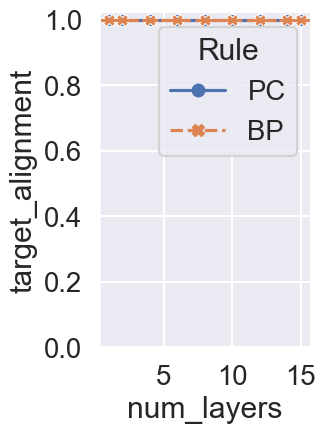

<!-- ## base-prospective-index

I suggested to compute the prospective index for hidden layers in one of the simulations of target alignment (Figure 3e), e.g. for a linear PCN with 6 layers.

```bash
# pending: learning rate 0.1
ray job submit --runtime-env runtime_envs/runtime_env_without_ip.yaml --address $pssr --  python main.py -c nature_target_alignment/base-prospective-index
```

```bash
# waiting
python analysis_v1.py \
-t "base-prospective-index" \
-l "$RESULTS_DIR/nature_target_alignment/" \
-m "df['train__prospective_index'].iloc[-1]" \
-f "./experiments/nature_target_alignment/base-prospective-index.yaml" \
-v \
"import experiments.nature_target_alignment.utils as u" \
"u.base_prospective_index(df)"
```

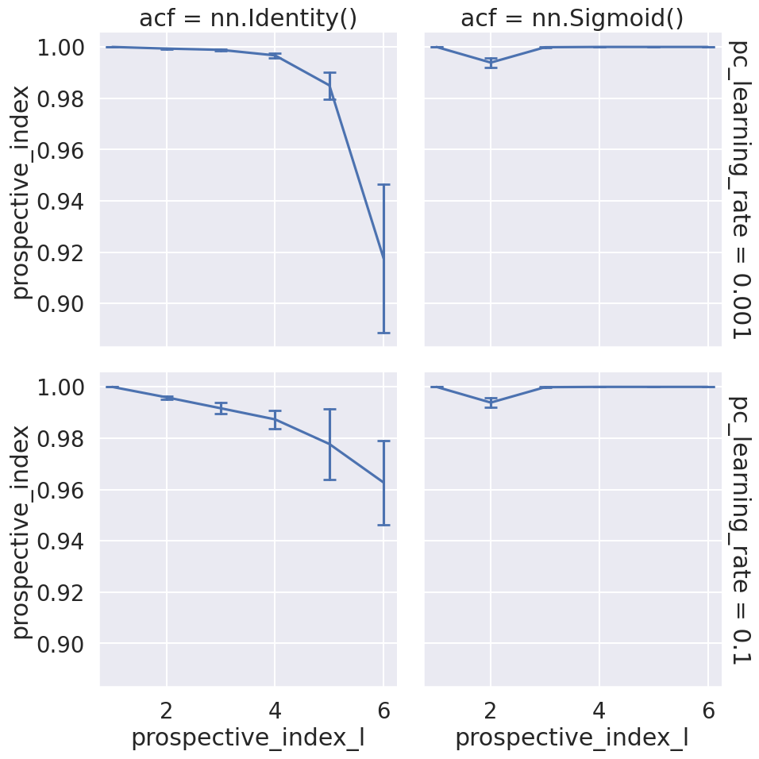

```bash
# waiting
python analysis_v1.py \
-t "base-target-alignment" \
-l "$RESULTS_DIR/nature_target_alignment/" \
-m "df['train__target_alignment'].iloc[-1]" \
-f "./experiments/nature_target_alignment/base-prospective-index.yaml" \
-v \
"import experiments.nature_target_alignment.utils as u" \
"u.base_nature_target_alignment(df)"
```

 -->